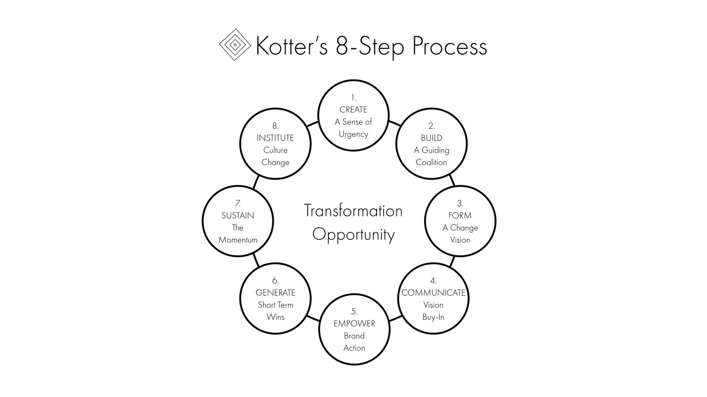

Das 8-Stufen-Modell eines Veränderungsprozesses ist unter den [Change Management](https://github.com/ManagingProjectsSuccessfully/ManagingProjectsSuccessfully.github.io/blob/main/kb/Change_Management.md) Modellen eines der bewährtesten.  
Ausgangspunkt der Entwicklung ist der 1995 erschienene Artikel "Leading Change: Why Transformation Efforts Fail"[^4], in welchem Kotter acht kritische Fehler beschreibt, die den Erfolg von organisationalen Veränderungsprozessen beeinträchtigen können.[^1]  
Das Modell, welches er in seinem 1996 erschienenen Buch "Leading Change" erstmals vorstellt, sieht vor, dass organisationale Veränderungsprozesse acht verschiedene Stufen durchlaufen, ehe sie erfolgreich sein können. Jeder dieser acht Schritte bezieht sich auf einen von Kotter in seinem Artikel "Leading Change: Why Transformation Efforts Fail", identifizierten Fehler.[^1]

[^2]

# Die acht Stufen des Modells
## 1. Erzeugen eines Dringlichkeitsgefühls
In der ersten Stufe ist es erforderlich, sowohl den Mitarbeitenden als auch allen Führungskräften die Notwendigkeit der Veränderungen aufgezeigt werden.[^1] Hierbei ist es wichtig, dass die Führungskräfte nicht unterschätzen, wie schwierig es sein kann, Menschen zu motivieren. Gute Führungskräfte schaffen es, ihre Mitarbeitenden auf einer emotionalen Ebene anzusprechen und einfache vorstellbare Botschaften zu kreieren, welche die Mitarbeitenden dazu inspirieren, Großes zu vollbringen.[^3]
## 2. Aufbauen einer Führungskoalition  
Ziel dieser Stufe ist es, ein Führungsteam zusammenzustellen, welches den gesamten Veränderungsprozess begleitet und anführt.[^1] Für dieses Team ist es wichtig, dass die folgenden vier Prämissen erfüllt werden:

- Es müssen genügend Schlüsselfiguren mit an Bord sein, sodass die verbleibenden Personen den Fortschritt nicht behindern können[^3]
- Alle relevanten Gesichtspunkte sollten betrachtet werden, sodass informierte Entscheidungen getroffen werden können[^3]
- Das Team sollte respektiert werden, sodass die Vorschläge und Entscheidungen ernst genommen werden.[^3]
- Es sollten genügend Führungskräfte mitmachen, sodass diese auch wirklich den Veränderungsprozess vorantreiben können[^3]

## 3. Entwickeln einer Vision
Das in der vorherigen Stufe gebildete Führungsteam muss nun eine Veränderungsvision erarbeiten. Diese dient dazu, die Mitarbeitenden zu motivieren und Verständnis über die Richtung der Veränderungen zu bilden. Die Vision sollte vorstellbar, realistisch sowie flexibel sein und die Interessen vieler Stakeholder abbilden.[^1]
## 4. Kommunizieren der Veränderungsvision
Im Mittelpunkt dieser Stufe steht die Kommunikation der Vision. Diese sollte einfach bildhaft über verschiedene Kanäle und möglichst oft an die Mitarbeitenden vermittelt werden.[^1] Die meisten Firmen unterkommunizieren ihre Vision um den Faktor 10, so ist zum Beispiel eine einzige E-Mail oder eine Reihe von Ansprachen nicht genug. Die Vision sollte täglich in E-Mails, Besprechungen und Präsentationen kommuniziert werden.[^3]
## 5. Befähigen der Mitarbeitenden auf breiter Basis
In der fünften Stufe sollen Hindernisse, welche Mitarbeitenden die Umsetzung der angestrebten Veränderungen erschweren, gelöst werden.[^1] So kann es vonnöten sein bestimmte organisationale Strukturen zu ändern, wenn diese konträr zur Vision sind. Ein Beispiel hierfür wäre bestimmte Informationssysteme im Unternehmen zu ändern, sodass diese erforderliche Maßnahmen unterstützen. Auch sind oftmals nicht von den Veränderungen überzeugte Führungskräfte Hindernisse, die es zu überwinden gilt. Generell gibt es für dieses Problem keine einfache Lösung, ein guter Ansatzpunkt ist jedoch ein ehrlicher Dialog.[^3]
## 6. Schaffen schneller Erfolge
Organisationale Veränderungen sind langwierige Prozesse, wodurch es umso wichtiger wird, kurzfristige Erfolge zu feiern. Diese werden benötigt, um die Glaubwürdigkeit des eingeleiteten Veränderungsprozesses zu sichern, darüberhinaus dienen diese kurzfristigen Erfolge als Belohnung der Bemühungen, etwas zu verändern. Außerdem erhöhen diese Erfolge das Dringlichkeitsgefühl und helfen dabei, Optimismus unter denen zu streuen, die die Veränderung vorantreiben.[^1][^3]
## 7. Konsolidieren der erzielten Erfolge und Einleiten weiterer Erfolge
Die siebte Stufe beinhaltet, dass bereits erzielte Erfolge gefestigt werden. Darauf aufbauend kann man neue Veränderungsideen kanalisieren und ebenfalls angehen. 

Ebenso ist es laut Kotter in dieser Stufe wichtig, das Ende eines großen Veränderungsprozesses nicht zu früh zu verkünden, da dadurch kritisches Momentum verloren gehen kann, was zu Rückschritten führen kann.[^1][^3]
## 8. Verankern der neuen Ansätze in der Kultur
Die finale letzte Stufe eines Veränderungsprozesses ist es, den Veränderungen in der Unternehmenskultur Platz zum Wachsen und Gedeihen zu geben.[^1] Ziel ist es, nicht mit der Vision übereinstimmende Teile der Unternehmenskultur loszulassen und neue Werte zu integrieren. Da die Unternehmenskultur oftmals nur schwer greifbar ist, führen erste erfolgreiche etablierte Veränderungen zu einem Wandel der Unternehmenskultur[^1]. Darüberhinaus ist es wichtig, dass der Großteil der Organisation hinter den Veränderungen steht, da ansonsten nicht mit langfristigem Erfolg zu rechnen ist.[^3]

# Siehe auch

* [Change Management](https://github.com/ManagingProjectsSuccessfully/ManagingProjectsSuccessfully.github.io/blob/main/kb/Change_Management.md)
* [Managing Change in Organisations](https://github.com/ManagingProjectsSuccessfully/ManagingProjectsSuccessfully.github.io/blob/main/kb/Managing_Change_in_Organisations.md)
* [Projektmanagement](https://github.com/ManagingProjectsSuccessfully/ManagingProjectsSuccessfully.github.io/blob/main/kb/Projektmanagement.md)
* [Projekt](https://github.com/ManagingProjectsSuccessfully/ManagingProjectsSuccessfully.github.io/blob/main/kb/Projekt.md)

# Quellen

[^1]: https://de.wikipedia.org/wiki/8-Stufen-Modell_eines_Ver%C3%A4nderungsprozesses_nach_J._P._Kotter
[^2]: https://images.squarespace-cdn.com/content/v1/57fedc98414fb543384c05a3/1533689238177-FVACHCSPDW5231EJ3TH3/Kotter-8-Step-Process.jpeg?format=1000w
[^3]: https://na.eventscloud.com/file_uploads/3f6e5b107e7e4a7251e67254fbf82afe_NancySullivan-The8-StepProcessforLeadingChange.pdf
[^4]: https://courseplus.jhu.edu/filedepot/onlinelibrary/1469/ARTICLE---Why-Transformation-Efforts-Fail.pdf

