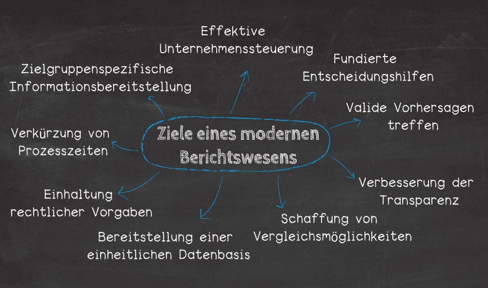

Das Berichtswesen, auch als [Reporting](Reporting.md) bekannt, setzt sich zusammen aus der Sammlung, Aufbereitung und der Verteilung von Informationen, über einen Betrieb oder 
beispielsweise ein [Projekt](Projekt.md) an die Stakeholder[^1].
Im Allgemeinen kann man sich unter dem Berichtswesen alle Anstrengungen einer Unternehmung vorstellen, die zur Erreichung, Verteilung und Sicherung von 
Projektinformationen, in Form von Berichten, angestellt werden[^2]. 
Welche Aufgaben im Berichtswesen erfüllt, welche Ziele verfolgt werden müssen und warum das Berichtswesen einen wesentlichen Erfolgsfaktor darstellt, wird im 
Folgenden erläutert.

# Aufgaben und Ziele des Berichtwesens

Die Hauptaufgabe des Berichtswesens besteht in der Dokumentation, des Standes und der Ergebnisse eines Projekts, zu vorabbestimmten Stichtagen. 
Ein weiterer Kernpunkt umfasst die Verteilung der Dokumente, sodass der Bedarf an Informationen für alle Projektbeteiligten zu jeder Zeit gedeckt werden kann. 
Somit bildet das Berichtswesen eine Brücke zwischen dem Entstehungs- und dem Anwendungsort von Daten und liefert die Datenbasis für beispielsweise das 
[Projektcontrolling](Projektcontrolling.md) oder die [Projektsteuerung](Projektssteuerung.md)[^3].
Die Aufgaben bestehen aus der Gewinnung, Dokumentation, Aufbereitung und Zurverfügungstellung der Daten. 
Ziele, die schließlich mit dem Berichtswesen verfolgt werden, sind: 

*	Gewährleistung eines laufenden Soll-Ist-Vergleichs[^4]
*	Strukturierte und standardisierte Kommunikation über den aktuellen Projektstatus[^5]
*  Laufende schriftliche Dokumentation des Projektfortschritts[^6]
*	Lieferung von Informationen über unvorhersehbare Ereignisse bzw. Störungen, um eine frühzeitig Gegensteuerung zu ermöglichen[^7]

*Ziele eines modernen Berichtswesens*[^8]

   
# Erfolgsfakor Berichtswesen

Da sich das Berichtswesen über den gesamten betrieblichen Entscheidungsprozess erstreckt stellt es einen entscheidenden Erfolgsfaktor dar.
Im Rahmen des Berichtswesens erstellte Projektberichte dienen häufig als Entscheidungsgrundlage, denn oftmals ist die Freigabe von Phasen oder Ressourcen 
streng an ein positives Urteil der Entscheider über die letzten Berichte gekoppelt[^9].

Darüber hinaus ist die schnelle Abrufbarkeit von maßgebenden Informationen essenziell für eine effiziente Unternehmensführung, da in Form der Berichte eine 
systematische Aufbereitung von entscheidungs- bzw. führungsrelevanten Informationen geliefert wird[^10].
Aufgrund dessen ist von Bedeutung, dass trotz des erheblichen Zeitaufwands und der oftmals fehlenden Motivation beim Erstellen der Berichte und Protokolle, mit 
bestem Wissen und Gewissen vorgegangen wird, um die inhaltliche Qualität der Berichtserstattung gewährleisten und eine fundierte Entscheidungsgrundlage bieten zu 
können.
Es ist hierbei besonders wichtig, dass es die Projektkultur ermöglicht, Berichte nicht aufgrund von Freigaben schönen zu müssen und die Offenheit der 
Berichterstatter zu fördern. Um jedoch die Wirtschaftlichkeit von den Berichten zu erhalten und den Zeitaufwand zu senken, können standardisierte Berichtsvorlagen
eingesetzt werden, was wiederum die Auswertbarkeit erhöht[^11].
Ist die [Projektsteuerung](Projektssteuerung.md) transparent können unnötige Reibungsverluste durch Fehlinformationen und bzw. oder Informationsdefizite vermieden werden. 
Der Berichtsprozess sollte daher zu Beginn eines neuen Projekts transparent erarbeitet und individuell an das Projekt angepasst werden und gegebenenfalls sollten 
neue Projektmitglieder angemessen in ihn eingewiesen werden, damit sich das Berichtswesen als Erfolgsfaktor niederschlägt[^12].

# Fazit

Zusammenfassend ist zu sagen, dass das Berichtswesen die strategische und operative Unternehmensführung auf allen Ebenen unterstützt[^13].
Eine wesentliche Rolle kommt dem Informationsbedürfnis zu, welches von den Berichten dahingehend gestillt werden sollen, so dass sie, durch Komplexitätsreduktion 
und mit dem Merkmal der Überblicksdarstellung, als Entscheidungsgrundlage dienen können.
Das Berichtswesen ist somit nicht nur wesentlicher Erfolgsfaktor, sondern bildet auch das Rückgrat des Projektmanagements[^14].
Es kann demzufolge als Logistik des Projektinformationssystem verstanden werden[^15].

# Quellen

[^1]: (https://www.projektmagazin.de/glossarterm/berichtswesen)
[^2]: (https://www.controllingportal.de/Fachinfo/Grundlagen/Berichtswesen-Reporting.html)
[^3]: (https://www.controllingportal.de/Fachinfo/Grundlagen/Berichtswesen-Reporting.html)
[^4]: (https://dieprojektmanager.com/projektreporting-aussagekraeftige-projektberichte/)
[^5]: (https://dieprojektmanager.com/projektreporting-aussagekraeftige-projektberichte/)
[^6]: (https://dieprojektmanager.com/projektreporting-aussagekraeftige-projektberichte/)
[^7]: (https://www.fibunet.de/lexikon/berichtswesen)
[^8]: (https://www.datapine.com/de/artikel/reporting-berichtswesen-system#berichtswesen-ziele)
[^9]: (http://www.daswirtschaftslexikon.com/d/berichtswesen/berichtswesen.htm)
[^10]: (https://www.fibunet.de/lexikon/berichtswesen)
[^11]: (https://www.projektmagazin.de/glossarterm/berichtswesen)
[^12]: (https://www.projektmanagementhandbuch.de/handbuch/projektrealisierung/berichtswesen/)
[^13]: (https://www.fibunet.de/lexikon/berichtswesen)
[^14]: (https://www.projektmanagementhandbuch.de/handbuch/projektrealisierung/berichtswesen/)
[^15]: (https://www.projektmagazin.de/glossarterm/berichtswesen)
