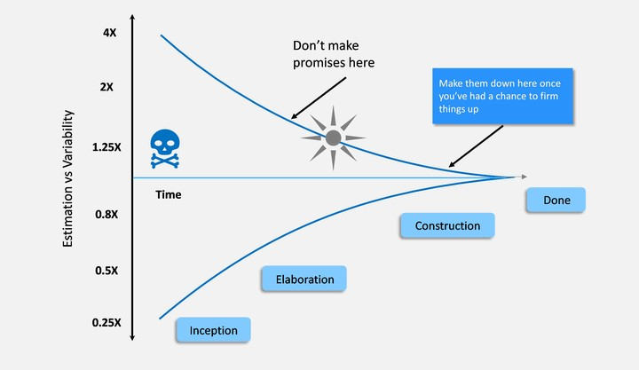
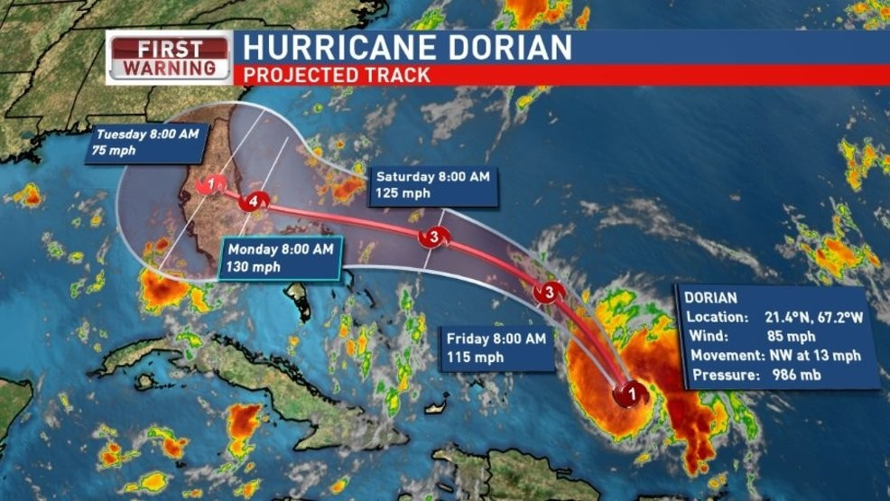

Der Cone of Uncertainty – im deutschen Kegel der Ungewissheit - ist eine graphische Darstellungsmethode dessen, dass zu Beginn eines Projekts etliche Ungewissheiten vorhanden 
sind. Diese Faktoren belegen Aussichten in die Zukunft wie beispielsweise Schätzungen mit zeitabhängigen Unsicherheiten.[^1]

# Begriffserklärung

Der Begriff Kegel soll hierbei ausdrücken, dass je weiter man in die Zukunft schaut, desto mehr können sich diese Störfaktoren addieren. Dieser Verlauf wird durch „die räumliche 
Vorstellung eines Kegels, der im Umfang immer größer wird“ sehr gut widergespiegelt. Dabei wird der Kegelumfang kleiner, je näher man vor [Projektabschluss](Projektabschluss.md)
steht.[^1] Erst wenn das zuständige [Projektteam](Projektmitarbeiter.md) ihre Tätigkeit vollständig abschließt, erreichen die Unsicherheiten die Null-Prozent-Marke[^2].

*Abbildung 1: Phasen des Cone of Uncertainty [^6]*

# Ursprung und Historie

Das ursprüngliche Konzept des Cone of Uncertainty wurde von der American Association of Cost Engineers für die Chemieindustrie entwickelt[^4]. Hierbei wurden für 
Kostenschätzungen Unsicherheitsbereiche etabliert[^5]. Im Zuge der Softwareentwicklung  wurde das Konzept von Barry Boehm aufgegriffen und als „Funnel Curve“ bezeichnet[^4].
16 Jahre später prägte Steve McConnel mit dem Buch „Software Project Survival Guide“ die Bezeichnung Cone of Uncertainty[^5].

# Anwendungen

  Der Anwendungsbereich ist breit gefächert, so wird der Ansatz wie bereits angesprochen heute noch in der Kostenschätzung verwendet[^5]. Bekannt ist der Effekt auch in der 
  Wettervorhersage, wie zum Beispiel „, wenn der mögliche Temperaturverlauf […] als Grafik gezeigt wird“. Dabei wird die Temperaturspanne zwischen Minimum und Maximum von Tag zu 
  Tag größer. [^1] Wie auf der folgenden Abbildung zu sehen ist auch die Hurrikan-Vorhersage ein wichtiges Anwendungsfeld. Der erwartete Korridor, bei dem der Sturm auf Land 
  trifft soll begrenzt werden. [^5] Deutlich zu erkennen ist auch hier die typische Kegelform. 

*Abbildung 2: Anwendung des Cone of Uncertainty in der Hurrikan-Vorhersage [^2]*

# Cone of Uncertainty im Projektmanagement 

Darstellungsmethoden, wie der Cone of Uncertainty sind im [Projektmanagement](Projektmanagement) von großer Bedeutung, um zentrale Aspekte aufzuzeigen. Diese sind besonders geeignet zur Illustration 
von Projektscope und -ziel, sowie wesentlicher Projektergebnisse. Im Allgemeinen sind Darstellungsmethoden für agile als auch klassische Projekte anwendbar, sodass der „Cone of 
Uncertainty unabhängig vom Paradigma (klassisch vs. agil) einsetzbar“ ist.[^1] 
Zu Beginn jedes Projekts weiß man nicht, wie viel Zeit dieses exakt in Anspruch nehmen wird. Die 
Gründe hierfür sind vielfältig. Projekte unterscheiden sich in den Anforderungen, Prioritäten, Einschränkungen, Technologien oder auch dem Geschäftsbereich und den daran 
beteiligten Personen. Jedes [Projekt](Projekt.md) ist individuell, wofür es jedoch einige hilfreiche Umgangsmöglichkeiten gibt. „Sizing the project relatively“, beschreibt den Ansatz, den 
Umfang eines Projekts mit den anderer zu vergleichen. Dadurch kann verhältnismäßig auf das Ausmaß, des zu betrachtenden Projekts geschlossen werden, was für die Orientierung 
von Vorteil ist. Daneben kann es nützlich sein, seine Berechnungen oder Schätzungen was benötigte Zeit oder Kosten angeht, etwas höher anzusetzen. Dadurch ergibt sich ein 
gewisser "Puffer" und im Projekt zusätzlich Spielraum. Hier ist jedoch darauf zu achten, die richtige Balance zu finden. Werden die Vorhersagen zu hochgesteckt, kann dies zum 
Beispiel mögliche Sponsoren abschrecken. Wird wiederrum zu wenig kalkuliert, läuft man Gefahr, dass finanzielle Mittel oder Zeit ausgehen. Weiterhin wichtig ist es, offen und 
ehrlich Zahlen und aktuelle Standpunkte mit Projektpartnern zu kommunizieren. Damit kann negativen Überraschungen aus dem Weg gegangen werden.[^3] 

# Siehe auch

* [Projekt](Projekt.md)
* [Projektmanagement](Projektmanagement.md)
* [Projektabschluss](Projektabschluss.md)
* [Projektteam](Projektmitarbeiter.md)

# Weiterführende Literatur

* The Agile Samurai - Jonathan Rassmuson(2016)
* Software Project Survival Guide - Steve McConnel(1997)
* Code Complete - Steve McConnel(2016)

# Quellen

[^1]: [Cone of Uncertainty - ProjectBase](https://project-base.org/projektmanagement-glossar/cone-of-uncertainty/)
[^2]: [Die Fibonacci-Folge und der Kegel der Unsicherheit](https://blog.agileskills.de/de/die-fibonacci-folge-und-der-kegel-der-unsicherheit/)
[^3]: [Cone of Uncertainty - Agile In a Nutshell](http://www.agilenutshell.com/cone_of_uncertainty)
[^4]: [Cone of Uncertainty - Wikipedia](https://en.wikipedia.org/wiki/Cone_of_Uncertainty)
[^5]: [Cone of Uncertainty Explained with Examples](https://www.projectpractical.com/cone-of-uncertainty/)
[^6]: [Cone of Uncertainty Image](https://www.sketchbubble.com/en/presentation-cone-of-uncertainty.html)
