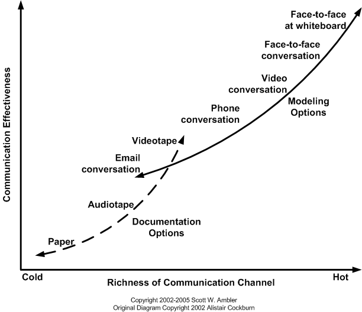

# 1. Definiton 

Als Grundlage der [Kommunikation](Kommunikation_Projektbeteiligte.md) bezeichnet man den Austausch von Informationen zwischen mindestens zwei Kommunikationspartnern. Die Kommunikationspartner können dabei sowohl Menschen als auch technische Systeme sein. Bei der digitalen Kommunikation wird die Nachricht von einem digitalen Kommunikationskanal wie dem Internet von einem Sender zum Empfänger übertragen. Dies kann in verschiedenen Medienformaten wie Text, Video, Bild oder Audio geschehen. Die digitale Kommunikation zeichnet sich dabei auch durch die Virtualität aus, das bedeutet die Entkopplung von Zeit und Raum[^1].

# 2. Kommunikationsmodell von Alistair Cockburn

Der Projekterfolg hängt von einer effektiven [Kommunikation](Kommunikation_Projektbeteiligte.md) ab. Kommunikationsmodelle zeigen Konzepte auf, die sich darauf beziehen, wie sich der Bezugsrahmen des Senders und des Empfängers auf die Effektivität der [Kommunikation](Kommunikation_Projektbeteiligte.md) auswirken. Weiterhin wie das Kommunikationsmedium die Effektivität der
Kommunikation beeinflusst und welche Arten von Diskrepanzen zwischen den Erwartungen der Endbenutzer und der Realität bestehen. 
Mit multikulturellen Projektteams und verstreuten Interessengruppen bieten diese Modelle eine Möglichkeit, Kommunikationsstile und -methoden zu betrachten, um die Effizienz und Effektivität zu verbessern [^2].

[^3]

Das Kommunikationsmodell von Alistair Cockburn beschreibt auf der Y-Achse die „Effektivität der Kommunikationsart“ und auf der X-Achse die „Medienreichhaltigkeit von Kommunikationskanälen“. "Medienreichhaltigkeit“ beinhaltet verschiedene Eigenschaften zur optimalen Kommunikation.                                     Diese Merkmale zeichnen die Media Richness Theory aus: 
*	Mehrere Informationen gleichzeitig verarbeiten
*	Erleichterung schnelles Feedback zu geben 
*	Einen individuellen Schwerpunkt für jedes Projektmitglied zu setzen, und 
* Eine "natürliche Sprache" zu nutzen [^2]

Nach Cockburn ist dadurch die effektivste Kommunikationsform von Angesicht zu Angesicht, insbesondere wenn sie durch ein gemeinsames Modellierungsmedium, wie ein einfaches Whiteboard, ein Flipchart, Papier oder Karteikarten unterstützt wird. Wenn man sich von dieser Kommunikationsform abwendet, etwa indem man das gemeinsame Medium entfernt oder nicht mehr von Angesicht zu Angesicht kommuniziert, sinkt die Effektivität der Kommunikation [^3].

# 3. Vorteile durch digitale Kommunikation
Die Vorteile digitaler Kommunikation liegen in der zeitlichen- und räumlichen Unabhängigkeit und in der Effizienz. E-Mails können zeitlich unabhängig versendet werden und erreichen den Empfänger innerhalb weniger Sekunden.
Die räumliche Unabhängigkeit spiegelt sich dadurch wieder, dass die Mitglieder eines Projektteams sich in verschieden Regionen oder sogar Zeitzonen befinden und durch Kommunikationssoftware trotzdem am Projektmeeting teilnehmen können.
Der größte Vorteil ist aber der Zeitgewinn, wodurch Aufträge „just in time“ vergeben werden können oder an [Projekten](Projekt.md) durch „Share-Optionen“ mehrere Personen gleichzeitig arbeiten können [^4].

# 4. Die Kommunikationssoftware Microsoft Teams

## 4.1 Was ist MS Teams?
Microsoft Teams ist ein Programm zur Unterstützung von digitaler Kommunikation und effektiver Zusammenarbeit im Team. Dabei eignet es sich als chatbasierter und videobasierter Arbeitsbereich. Des Weiteren können [Microsoft Technoliegen](Microsoft_Project_PM_Tool.md) und Office 365 Funktionen integriert werden [^5].

## 4.2 Wichtige Funktionen in MS Teams

Chat- und Videofunktion:
* Chatfunktion für bis zu 50 Personen zur optimalen Abstimmung im Projektteam 
* Videofunktion für Einzelgespräche und Gruppenmeetings 

Feed-Funktion:
*	Übersicht über die Aktivitäten im Teammeeting 
*	Filterfunktion und Aktivitäten können chronologisch geordnet werden 

Share-Optionen: 
* Co-Authoring-Funktion von Office 365-Anwendungen zur parallelen Bearbeitung von Dokumenten 
*	Anwendungen müssen nicht mehr gewechselt werden, sondern Dokumente können direkt in MS Teams bearbeitet werden

Verschiedene Tools zur optimalen Projektbearbeitung: 
*	Workspace in MS Teams individuell an verschiedene Arbeitsgruppen anpassbar
*	So kann man alle möglichen Inhalte aus verschiedenen Microsoft-Anwendungen und von mehr als 150 Drittanbietern nutzen [^6]

# Siehe auch
* [Übersicht PM-Tools](Uebersicht_PM_Tools.md)
* [Projektkommunikation](Projektkommunikation.md)
* [Kommunikation_Projektbeteiligte](Kommunikation_Projektbeteiligte.md)
* [Digitalsierung im PM](Digitalisierung_im_PM.md)

# Weiterführende Literatur 
*[Digitale Kommunikation-Vernetzen, Multimedia, Sicherheit](https://link.springer.com/content/pdf/10.1007%2F978-3-540-92923-9.pdf)

# Quellenverzeichnis
[^1]: Digitale Kommunikation: https://link.springer.com/content/pdf/10.1007%2F978-3-540-92923-9.pdf (S. 12 ff.)
[^2]: A Guide to the Project Management Body of Knowledge - PMBOK® GUIDE (S. 157)
[^3]: Communication on Agile Software Teams: http://agilemodeling.com/essays/communication.htm
[^4]: Digital ist alles: https://www.perwiss.de/digitale-kommunikation.html
[^5]: Was ist MS Teams: https://www.theprojectgroup.com/de/office-365-microsoft-teams-chat
[^6]: Fünf Funktionen von MS Teams: https://news.microsoft.com/de-de/microsoft-teams-funktionen/
