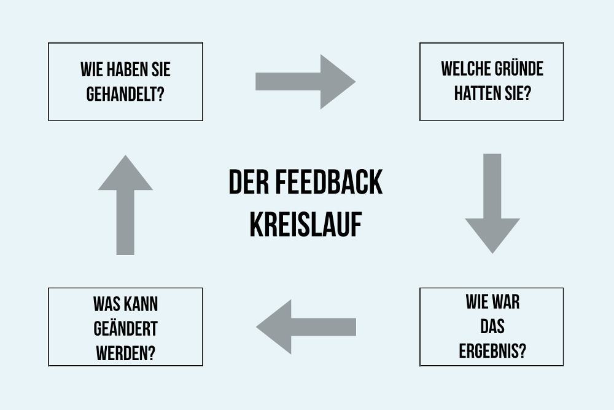

# Feedback-Kultur

 
[^1]

# 1. Definition 
[Feedback](https://de.wikipedia.org/wiki/Feedback_(Kommunikation)) ist ein wichtiger Bestandteil der zwischenmenschlichen [Kommunikation](https://managingprojectssuccessfully.github.io/kb/Projektkommunikation.html) und bedeutet jemandem Rückmeldung zu geben. Feedback ist im Idealfall weder wertend noch deutend, lässt keine Interpretation oder Beurteilung zu und dient auch nicht als Provokation oder Vorwurf. Der Begriff Feedbackkultur beschreibt damit eine von gegenseitigem Vertrauen geprägte Unternehmenskultur. In dieser können sich Mitarbeitende unabhängig von Hierarchien und Funktionen regelmäßig gegenseitiges Feedback zu deren Leistungen, dem Verhalten aber auch deren Außenwirkung geben. Dieses von Offenheit, Vertrauen und hierarchieübergreifender Kommunikation geprägte Arbeitsklima, lebt von strategisch geplanten sowie mit passenden [Feedbackmethoden](https://managingprojectssuccessfully.github.io/kb/Feedback_Methoden.html) durchgeführten regelmäßigen Rück- und Statusmeldungen. [^2]

# 2. Ziel & Funktion 
Offene und vor allem angstfreie Kommunikation kann diverse Aspekte eines Unternehmens fördern, wodurch dieses die Möglichkeit erhält neue Ressourcen auszuschöpfen. 

## 2.1 Funktionen für Mitarbeitende im speziellen:
* Steigert die Motivation
* Unterstützt bei der Identifikation mit der Arbeitsumgebung, lässt zielgerichtet arbeiten und bewirkt eine engere Verbindung mit der Aufgabe
* Ermöglicht klarere Selbsteinschätzung und fördert persönliche Lernprozesse
* Feststellung des Leistungsniveaus und hilfreich bei der Karriereplanung
* Effektiviert Fehlersuche und trägt zur Lösung von Missverständnissen und [Konflikten](https://managingprojectssuccessfully.github.io/kb/Konfliktmanagement.html) bei
* Vertrauen zwischen [Führungskräften und Mitarbeitern](https://managingprojectssuccessfully.github.io/kb/Kommunikation_Projektbeteiligte.html) sowie das Selbstbewusstsein der Mitarbeiter steigen
[^3][^4][^5]

## 2.2 Zusätzliche Funktionen für das Unternehmen im Ganzen:
* Überprüfung unternehmensstrategischer Maßnahmen
* Entwicklung von Anreiz- und Entlohnungssystemen
* Schnellere Lern- und Optimierungsprozesse
* steuert Verhalten der Mitarbeiterschaft
* Mitarbeiter auf allen Ebenen denken mit und entfalten mehr Eigeninitiative
* höherer Attraktivität als Arbeitgeber speziell für hochqualifizierte Mitarbeiter
* reibungslosere Abläufe, da Störfaktoren offen angesprochen werden
* Mitarbeiter fühlen sich mehr wertgeschätzt und identifizieren sich stärker mit ihrem Arbeitgeber
[^3][^4][^5]

# 3. Relevanz 
Die Entwicklung einer Feedbackkultur hat im Unternehmenskontext in den letzten Jahren zunehmend an Bedeutung gewonnen, da deren Strukturen immer stärker vernetzt werden und die Team- und [Projektarbeit](https://managingprojectssuccessfully.github.io/kb/Projekt.html) zunehmend zur Regelarbeitsform wird. Gleichzeitig agieren Unternehmen in einem zunehmend von schnellem Wandel und geringer Vorhersehbarkeit geprägten Umfeld. Damit das Unternehmen besser auf Veränderungen reagieren kann, müssen Mitarbeitende mehr Eigeninitiative zeigen.[^4]

# 4. [Feedbackinstrumente](https://managingprojectssuccessfully.github.io/kb/Feedback_Methoden.html) 

Zu den gängigsten Feedbackmethoden zählen:
* [Mitarbeitergespräche](https://managingprojectssuccessfully.github.io/kb/Feedbackgespräche.html)
* 360-Grad-Feedback
* Upward-Feedback
[^6]

# 5. Feedbackregeln 
Feedback braucht Regeln. Effektiv können diese Regeln aber nur angewendet werden und Veränderungen im Verhalten bewirken, wenn der Feedbackgeber ehrlich ist. Dessen nonverbale Signale sollten mit den verbalen übereinstimmen. Somit muss auch viel auf die eigene Gestik und Mimik, nicht nur auf das Gesprochene Wort geachtet werden. Werden die folgenden zehn Regeln von befolgt, ist das eine solide Grundlage für konstruktives Feedback. 

## 5.1 Feedbackregeln für den Feedbackgeber
1.	Bereitschaft des Nehmers klären
2.	Ich-Botschaften senden
3.	Konkrete & positive Formulierungen
4.	Zeitpunkt des Feedbacks sollte zeitnah liegen
5.	wertschätzende & konstruktive Rückmeldungen mit Entwicklungsmöglichkeiten aufzeigen
[^7]

## 5.2 Feedbackregeln für den Feedbacknehmer 
1.	konzentriert zuhören und ausreden lassen
2.	Nützliches aufnehmen, anderes vernachlässigen
3.	nicht erklären, rechtfertigen oder verteidigen 
4.	Bei Unklarheiten nachfragen 
5.	dankbar sein
[^7]

# 6. Feedbackkreislauf
Erfolgsversprechender ist Feedback wenn es als fortlaufender Prozess im Unternehmen etabliert wird und nicht als einmalige Aktion verstanden wird. Dieser sich entwickelnde Kreislauf funktioniert dauerhaft, ist unabhängig von zeitlichen Vorgaben und Terminen. Eine richtige Feedback-Kultur kann nur realisiert werden, wenn dieser Prozess zur Routine wird. [^8]

[^9]

# Quellen

[^1]: [Feedback-Bild](https://hr-pioneers.com/wp-content/uploads/2014/03/Feedback.jpg)
[^2]: [So stärken Sie die Feedbackkultur in Ihrem Unternehmen](https://www.umantis.com/personalentwicklung/feedbackkultur?akttyp=direkt&aktnr=84834&wnr=04393689)
[^3]: [Feedback geben](https://www.berufsstrategie.de/bewerbung-karriere-soft-skills/feedback-geben.php)
[^4]: [Feedback-Kultur–Definition](https://www.kraus-und-partner.de/wissen-und-co/wiki/feedback-kultur-entwickeln-berater-beratung)
[^5]: [Was ist Feedback?](https://managementstellen.ch/was-ist-feedback)
[^6]: [Feedback geben – aber richtig: So etablierst du eine starke Feedbackkultur](https://engage.kununu.com/de/blog/starke-feedbackkultur/#flache-hierarchien-erschweren-die-feedbackkultur)
[^7]: [FEEDBACKREGELN EINFACH ERKLÄRT - SO GEBEN SIE WERTSCHÄTZENDES UND ERHALTEN QUALIFIZIERTES FEEDBACK](https://shyopa.com/ratgeber/feedbackregeln/)
[^8]: [Feedbackregeln: So klappt die Rückmeldung](https://karrierebibel.de/feedbackregeln/)
[^9]: [Bild-Feedbackkreislauf](https://karrierebibel.de/wp-content/uploads/2017/09/Feedbackregeln-Kreisualf-Ablauf-Beispiele-Grafik.png)

