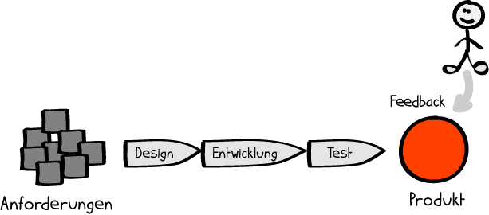

# Missverständnisse des klassischen Projektmanagements
Die falsche Anwendung des [klassischen Projektmanagements](https://www.projektmagazin.de/glossarterm/traditionelles-projektmanagement) kann schnell zu Missverständnissen führen, welche einen großen Einfluss auf die Erfolgswahrscheinlichkeit des jeweiligen [Projektes](Projekt.md) haben. So können beispielsweise die Ergebnisse nicht den Anforderungen entsprechen, Kosten werden überschritten oder Termine nicht eingehalten.[^1] Aus diesem Grund ist es wichtig, die klassischen Missverständnisse zu kennen und diese bewusst zu vermeiden. 

# Ursache der Missverständnisse
Das traditionelle [Projektmanagement](Projektmanagement.md) beruht auf einem monolithischen Ansatz, bei welchem bereits zu [Projektstart](Projektstart.md) der gewünschte Endzustand definiert und die genaue Vorgehensweise geplant wird. So werden beispielsweise von Anfang an bestimme Ergebnisse, Kosten, [Termine](Zeitplanung.md) und [Ressourcen](Ressourcenplanung.md) festgelegt.[^1][^2]  Dieser standardisierte Vorgang kann im Laufe des [Projektes](Projekt.md) allerdings zu mehreren verschiedenen Missverständnissen führen.
 

# Fehlende Flexibilität bei Veränderungen

In nahezu allen [Projekten](Projekt.md) kommt es im Laufe der Zeit zu sich veränderten Anforderungen und Bedürfnissen. Aufgrund der klassischen Vorgehensweise hat die Projektplanung jedoch nicht die notwendigen Freiheiten, um auf Veränderungen flexibel einzugehen, da sie aufwendige und oftmals kostspielige Projektanpassungen nach sich ziehen würden.[^1]  Stattdessen wird strikt an dem ursprünglichen Plan festgehalten. Somit gibt es kaum Möglichkeiten Ziel- und Planänderungen zu treffen, wodurch vor allem bei den immer komplexer werdenden [Projekten](Projekt.md) Unstimmigkeiten entstehen.[^3]  

# Unschärfe in der Projektplanung

Um dennoch auf Veränderungen im Projektverlauf reagieren zu können, wird bereits zu [Beginn des Projektes](Projektstart.md)) Reserve in die Planung mit einbezogen. Dies führt allerdings erneut zu Missverständnissen. Durch den Einbezug von Reserve besteht von Anfang eine gewisse Unschärfe in der Planung, welche im späteren Projektverlauf sogar noch zunehmen kann. Außerdem handelt es sich bei den Reservefaktoren vor allem um die [Terminierung](Zeitplanung.md) und Budgetierung, weshalb es bei klassischen [Projekten](Projekt.md) oftmals zu Verzögerungen und Kostensteigerungen kommen kann.[^1][^2]

# Unstimmigkeiten beim Projektablauf
Ein weiteres Missverständnis entsteht beim Ablauf der klassischen [Projekte](Projekt.md). Im Gegensatz zum [agilen Projektmanagement](https://www.projektmagazin.de/glossarterm/agiles-projektmanagement) wird das [Projekt](Projekt.md) nicht in kleinere Aufgabenblöcke heruntergebrochen, welche zu früh überprüfbaren Ergebnissen führen würden. Es fehlen somit regelmäßige Zwischenprodukte, welche kontinuierlich angepasst und verbessert werden könnten (sog. Sprints beim agilen Projektmanagementmodell [SCRUM](SCRUM.md)). 
Stattdessen werden beim [klassischen Projektmanagement](https://www.projektmagazin.de/glossarterm/traditionelles-projektmanagement) komplexere [Projektphasen](Projektphasen_klassisch.md) nacheinander und nicht parallel bearbeitet. Die größeren Arbeitsblöcke lassen sich schwieriger verwalten, wodurch ein deutlich höheres Risiko für Fehlentscheidungen entsteht. Zusätzlich geht der Motivationsaspekt für das arbeitende Team verloren, da beim [traditionellen Projektmanagement](https://www.projektmagazin.de/glossarterm/traditionelles-projektmanagement) kein frühzeitig nutzbarer Mehrwert entsteht.[^4]

## Rückmeldung der Projektergebnisse

Eng damit verknüpft ist die Rückmeldung an die Auftragsgeber. Da keine Zwischenprodukte oder –ergebnisse präsentiert werden können, gehen entscheidende [Feedbackgespräche](Feedbackgespräche.md) im Projektverlauf verloren, welche für die weiteren Prozessschritte hätten berücksichtigt werden können. Stattdessen werden die Projektergebnisse erst am Ende des [Projektes](Projekt.md) bereitgestellt. Somit haben die Auftragsgeber vor Projektende keine Möglichkeit Feedback zu geben, wie die folgende [Grafik](https://projekte-leicht-gemacht.de/blog/pm-methoden-erklaert/klassisch-agiles-projektmanagement-1/) veranschaulicht.[^5] 

        
*Zeitpunkt des Feedbacks beim klassichen Projektmanagement*      

Dadurch entstehen wiederum neue Missverständnisse. Es können beispielsweise Anforderungsänderungen unentdeckt bleiben, wodurch umfangreiche Anpassungen notwendig werden, welche vor allem im späteren Verlauf des [Projektes](Projekt.md) zu immer höheren Kosten führen (siehe [Grafik](https://projekte-leicht-gemacht.de/blog/klassisches-agiles-projektmanagement-teil-3/)) .[^6]

        
*Anstieg der Änderungskosten im Verhältnis zur Zeit* 

## Unverhältnismäßige Rahmenbedingungen 

Ein weiterer Aspekt, welcher zu klassischen Missverständnissen führt, sind unverhältnismäßige Rahmenbedingungen. Unrealistische Zeitvorgaben oder Budgetrahmen, der unterschätzte [Projektumfang](Projektumfang.md) sowie fehlerhafte [Projektkommunikation](Projektkommunikation.md) bestärken die bereits genannten Missverständnisse stark.[^7][^8]

# Fazit
Um klassische Missverständnisse bei [Projekten](Projekt.md) zu vermeiden, ist es deshalb besonders wichtig genau abzuwägen, ob das [klassische Projektmanagement](https://www.projektmagazin.de/glossarterm/traditionelles-projektmanagement) zur Ausgangslage, Aufgabenstellung und Zielsetzung passt. Nur wenn diese Vorraussetzungen erfüllt sind, kann das [Projekt](Projekt.md) erfolgreich und wirtschaftlich verlaufen.[^1]

# Siehe auch

* [Projektmanagement](Projektmanagement.md)
* [Praxisbeispiele gescheiterter Projekte](Praxisbeispiele_gescheiterte_Projetke.md)

# Weiterführende Literatur

* [Traditionelles Projektmanagement](https://www.projektmagazin.de/glossarterm/traditionelles-projektmanagement)
* [Unterschiede zwischen klassischem und agilem Projektmanagement Teil 2](https://projekte-leicht-gemacht.de/blog/pm-methoden-erklaert/klassisches-agiles-projektmanagement-teil-2/)

# Quellen

[^1]: [Klassisches versus agiles Projektmanagement](https://www.proles.ch/blog/klassisches-versus-agiles-projektmanagement)
[^2]: [Projektmanagement](https://www.materna.de/Microsite/Monitor/DE/2020-01/Management-und-Strategie/pm-methoden/pm-methoden_node.html;jsessionid=87298AEC46E44A72560858EBF7715CBD.delivery2-master)
[^3]: [Agiles vs. klassisches Projektmanagement](https://www.roth-institut.de/roth-wissens-journal/wissen-f%C3%BChrung/agiles-vs-klassisches-projektmanagement/)
[^4]: [Unterschiede zwischen klassischem und agilem Projektmanagement Teil 4](https://projekte-leicht-gemacht.de/blog/pm-methoden-erklaert/klassisches-agiles-projektmanagement-teil-4/)
[^5]: [Unterschiede zwischen klassischem und agilem Projektmanagement Teil 1](https://projekte-leicht-gemacht.de/blog/pm-methoden-erklaert/klassisch-agiles-projektmanagement-1/)
[^6]: [Unterschiede zwischen klassischem und agilem Projektmanagement Teil 3](https://projekte-leicht-gemacht.de/blog/klassisches-agiles-projektmanagement-teil-3/)
[^7]: [Warum das Projekt-Team versagt- Die 10 größten Probleme im Projekt-Management](https://www.computerwoche.de/a/warum-das-projekt-team-versagt,2495865,5)
[^8]: [Welche Schwächen hat das klassische Projektmanagement ?](https://www.it-prause.de/fachbeitr%C3%A4ge/was-ist-klassisches-projektmanagement/die-schw%C3%A4chen-des-klassischen-projektmanagements/)

