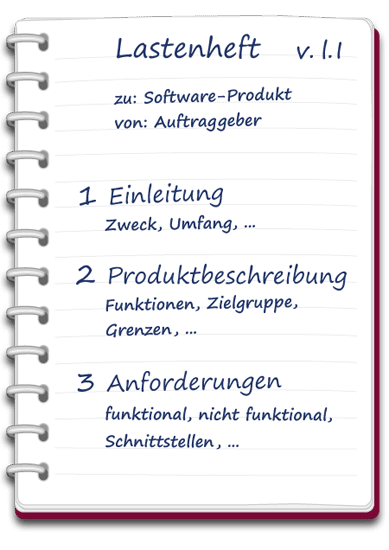

Das Lastenheft beschreibt alle Anforderungen des Auftraggebers an die Lieferung und Leistung des Auftragnehmers[^1].

Die Anforderungen in der Spezifikation sollten so weit wie möglich zusammengefasst und bei Bedarf eingeschränkt werden. 
Dies gibt dem Auftragnehmer die Möglichkeit, geeignete Lösungen (z.B. Software) zu entwickeln, ohne seine Lösungsfähigkeiten durch zu spezifische Anforderungen einzuschränken[^1].

Der Kunde kann das Lastenheft im Angebot verwenden und an mehrere mögliche Auftragnehmer senden. Jeder von ihnen erstellt ein Lastenheft, in dem in genauerer Form beschrieben wird, wie sie die Anforderungen im Lastenheft adressieren wollen. Der Auftraggeber wählt dann aus den Vorschlägen möglicher Auftragnehmer den für ihn am besten geeigneten aus[^1].

# Aufbau eines Lastenhefts

In der Gliederung des Lastenhefts sind in der Regel folgende Punkte enthalten:
* Spezifikation der auszuführenden Arbeiten (Lieferprojekt, Lieferprojekt, Projektprodukt)[^2]
* Anforderungen an die spätere Verwendung des Produkts (z. B. Temperaturbereich)[^2]
* Rahmenbedingungen für die Bereitstellung von Produkten und Dienstleistungen (wie Normen, Richtlinien, Materialien etc.)[^2]
* Vertragsbedingungen (wie Erbringung von Teilleistungen, Gewährleistungspflichten, Risikomanagement, etc.)[^2]
* Anforderungen an Auftragnehmer (z. B. Zertifizierung)[^2]
* Anforderungen an das Projektmanagement des Auftragnehmers (z. B. Projektdokumente, Kontrollmethoden)[^2]

*Lastenheft[^3]*

Beispiel[^1]:

1. Einführung
2. Beschreibung des Ist-Zustands
3. Beschreibung des Soll-Konzepts
4. Beschreibung von Schnittstellen
5. Funktionale Anforderungen
6. Nichtfunktionale Anforderungen
   * Benutzbarkeit
   * Zuverlässigkeit
   * Effizienz
   * Änderbarkeit
   * Übertragbarkeit
   * Wartbarkeit
7. Risikoakzeptanz
8. Skizze des Entwicklungszyklus und der Systemarchitektur
9. Lieferumfang
10. Abnahmekriterien

# Erstellung des Lastenhefts

Das Lastenheft sollte so früh wie möglich im [Projekt](Projekt.md) formuliert werden. Idealerweise wird es noch vor dem eigentlichen Projektauftrag erstellt, damit der Projektauftrag auf das Lastenheft verweisen kann. In der eigentlichen Projektarbeit, im Rahmen der Projektarbeit, kommt es bei vielen Projekten jedoch häufig vor, dass das Lastenheft mehrfach geändert wird. Dies ist in der Regel erforderlich, wenn bei der Formulierung der Spezifikation unbekannte Ergebnisse vorliegen. Bei Großprojekten ist es auch gewohnt, die Erstellung des Lastenheftes als eigenständiges Vorprojekt zu beauftragen und dann auf dieser Basis das eigentliche Hauptprojekt zu starten[^4].

# Definition nach Standarts

* DIN und PMBOK(R):
  - Die DIN 69901-5: 2009-1 „Projektmanagement-Projektmanagementsystem-Teil 5: Terminologie“ definiert das terminologische Lastenheft im obigen Sinne. Der [PMBOK (R) Guide 2008](PMBOK_Guide.md) hat den Umfang des Statement of Work (SOW) etwas eingeengt. SOW wird dort als Beschreibung der zu erbringenden Leistung oder Leistung definiert. Dies umfasst nur die Spezifikationen des Produkts oder der Dienstleistung[^2].
  
* ICB 3.0:
  - ICB 3.0 hat keine klare Namenskonventionstabelle. Stattdessen wird  von "Projektumfang" und "zu erbringenden Leistungen" gesprochen. Im deutschen Competence Baseline NCB 3.0 wird mindestens ein Begriffspaar „Technisches Kompetenz-Lastenheft/[Pflichtenheften](Pflichtenheft.md)“, Leistungsumfang und Liefergegenstand“ genannt[^2].
  
* [Prince2](prince2.md):
  - Prince2 macht die Systematisierung von Lastenheften und Pflichtenheften komplett überflüssig, da es den Beschaffungsprozess nicht beschreibt. Inhaltlich wurde das Prince2 Pflichtenheften des Gesamtprojektes durch die Beschreibung der Projektaufgaben und Projektprodukte ersetzt. PRINCE2 verwendet Produktstrukturpläne und Produktbeschreibungen und Managementstrategien anstelle von Anforderungsspezifikationen, die im Rahmen des Projekts entwickelt werden müssen[^2]. 

# Nachteile vom klassischen Lastenheft

Das Lastenheft stammt hauptsächlich aus dem klassischen [Projektmanagement](Projektmanagement.md). Anfänglich wird etappenweise gearbeitet, so werden zu Beginn des Projekts das gesamte Lastenheft entwickelt und auf dieser Basis das System. Das hat gravierende Nachteile: 
Zum Beispiel kennt man in der Regel zu Beginn des Projekts noch nicht alle Anforderungen. Diese ergeben sich meist aus bestehenden Systemkomponenten oder Architekturen. Darüber hinaus ändern sich die Bedürfnisse von Kunden oder Stakeholdern, sodass noch Änderungen getätigt werden müssen[^3].

# Siehe auch

* [Projekt](Projekt.md)
* [PMBOK (R) Guide 2008](PMBOK_Guide.md)
* [Pflichtenheften](Pflichtenheft.md)
* [Projektmanagement](Projektmanagement.md)

# Weiterführende Literatur

https://www.business-wissen.de/hb/was-beinhaltet-ein-lastenheft/

# Quellen

[^1]: https://de.wikipedia.org/wiki/Lastenheft
[^2]: https://www.projektmagazin.de/glossarterm/lastenheft
[^3]: https://www.microtool.de/wissen-online/was-ist-ein-lastenheft/
[^4]: https://www.projektmanagementhandbuch.de/handbuch/projektplanung/lastenheft/

