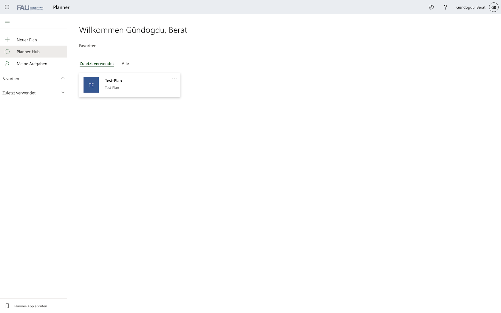
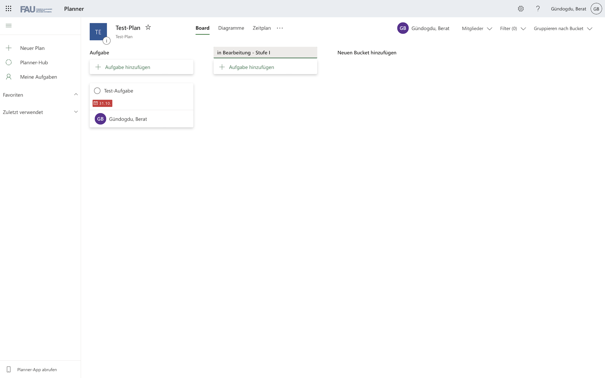
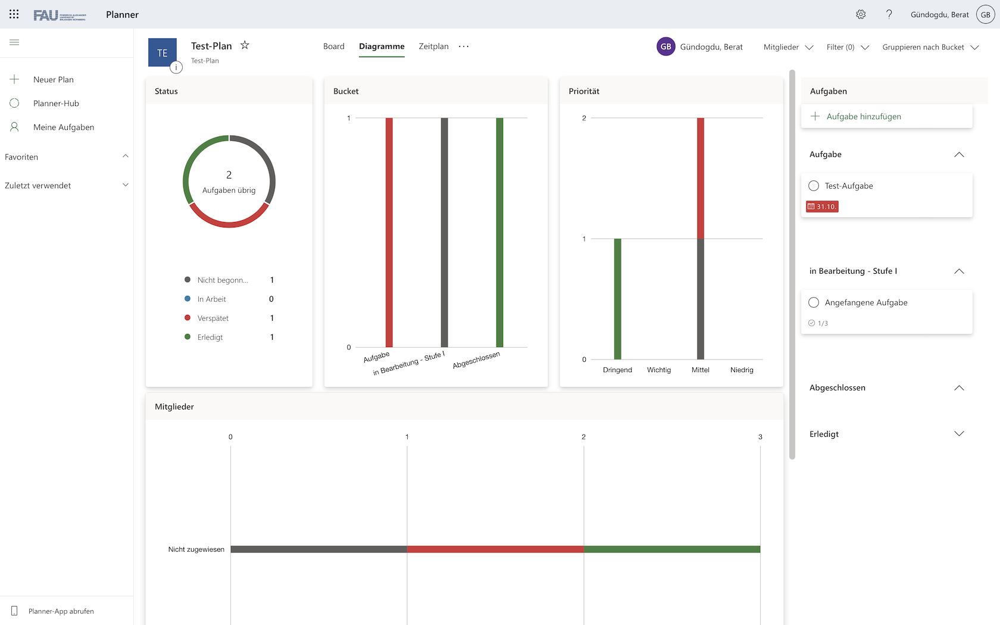
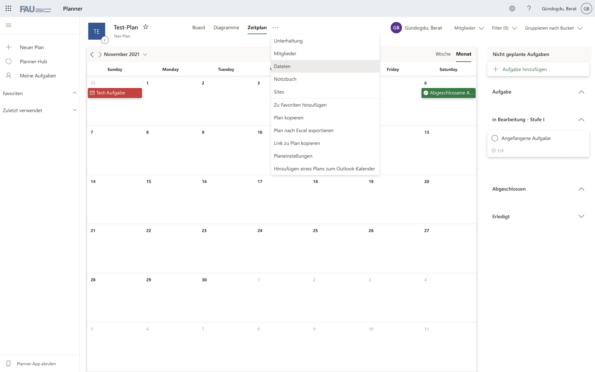

 
*Microsoft Planner - Logo*

## Inhaltsverzeichnis
 > - [Oberfläche und Funktionen](Microsoft_Planner_PM_Tool.md#oberfläche-und-funktionen-4)
 > - [Vergleich zu Microsoft Project und To Do](Microsoft_Planner_PM_Tool.md#vergleich-zu-microsoft-project-und-to-do)
 >    - [Microsoft To Do](Microsoft_Planner_PM_Tool.md#microsoft-to-do)
 >    - [Microsoft Project](Microsoft_Planner_PM_Tool.md#microsoft-project)
 > - [Siehe auch](Microsoft_Planner_PM_Tool.md#siehe-auch)
 > - [Quellen](Microsoft_Planner_PM_Tool.md#quellen)

Microsoft Planner ist ein von Microsoft entwickeltes Aufgabenverwaltungs-Tool und seit dem 06. 06. 2016 Teil der Microsoft 365 (ehemals Office 365) Business, Education und Enterprise Umgebung.[^1] [^2]

Seitens Microsoft wird dafür eine webbasierte Anwendung, lokale Verwendung über gängige Betriebssysteme wie Microsoft Windows und MacOS, sowie mobile Betriebssysteme wie Android, iOS und iPadOS angeboten.[^1] [^3]

Der Microsoft Planner bietet vielseitige Funktionen, darunter etwa  die Erstellung von Aufgabenplänen und vereinzelten Aufgaben zur teamorientierten Projektverwaltung. Diese können einzelnen Personen zugewiesen und der Status jederzeit angezeigt werden.[^3]  

Der Microsoft Planner wird besonders aufgrund der intuitiven Oberfläche und der Office 365 Integration in vielen Unternehmen eingesetzt.[^3]
# Oberfläche und Funktionen [^4]

| Abbildung     | Beschreibung |
| ----------- | ----------- |
| **Startoberfläche des Planners**   *Abbildung 1 - Planerstellung*|• Plannamen vergeben  • Plan zu einer Microsoft 365 Gruppe hinzufügen  •	Zugriff und Sichtbereich des Plans einschränken (besonders relevant in großen Unternehmen mit zentraler IT)   • optionale Gruppenbeschreibung  |
| **"Planner Hub" Oberfläche**    *Abbildung 2 - "Planner Hub"*   |•	Übersicht aller Pläne, in denen man Mitglied ist|
| **"Board" Oberfläche**    *Abbildung 3 - Planoberfläche in "Board" Übersicht* |•	Zugriff durch Auswahl eines Plans   •	Darstellung der Aufgaben in drei verschiedenen Übersichten  •	"Board" Übersicht als digitales [KANBAN-Board](Kanban_Boards.md) mit [KANBAN-Karten](Kanban_Karten.md)[^5]   •	"Board" Übersicht stellt Aufgaben in Form von Kärtchen in Spalten ("Buckets") dar   •	"Buckets"	beliebig benennbar und Anzahl unbeschränkt  •	Aufgaben nach selbstbestimmten Faktoren gruppierbar (hier: Gruppierung nach Bearbeitungsstand)  |
| **"Aufgabe hinzufügen" Oberfläche**     *Abbildung 4 - Aufgaben hinzufügen* |•	 Aufgabennamen, Aufgabenstatus, Aufgabenpriorität und Start- und Fälligkeitsdatum angeben   •	 Aufgabe einer oder mehreren Personen zuweisen  •	Notizen, Checkliste und Kommentare zur genaueren Spezifizierung  •	Anlagen zur Verknüpfung der Aufgabe mit benötigten Dokumenten  |
| **"Diagramme" Oberfläche**    *Abbildung 5 - "Diagramme" Übersicht*    |•	verschiedene Diagramme zu ausgewähltem Plan  •	schneller Überblick über momentanen Stand des Projektes auch bei hoher Anzahl an Aufgaben|
|  **"Zeitplan" Oberfläche**    *Abbildung 6 - "Zeitplan" Übersicht*  |•	Darstellung von Aufgaben in Kalender-Ansicht (falls Start- und Fälligkeitsdatum definiert)  •	Überprüfung des Zeitplans|
| **"Mehr" Schaltfläche**    *Abbildung 7 - Schaltfläche "Mehr"*|•	dargestellt als drei Punkte  •	Vielzahl weiterer Funktionen durch Verknüpfung zu anderen Office Apps  •	Anzeige der Mitglieder (keine lokalen Benutzer, sondern Microsoft 365 Accounts)  •	implementierte Outlook Funktionalität zur Benachrichtigung von Mitgliedern bei Statusveränderungen von Aufgaben  •	SharePoint-Funktionalität:    o	verknüpfte Dateien in einem projektspezifischen Dateiverzeichnis (Wird bei Erstellung eines Plans automatisch miterstellt)  o	Zugriff nur für Planmitglieder (externer Zugriff bei Bedarf erteilbar)  o	"Sites" zur Website Erstellung z.B. zur Projektbeschreibung  • "Notizbuch" - speziell für den ausgewählten Plan erstelltes OneNote-Notizbuch  |

# Vergleich zu Microsoft Project und To Do 
## Microsoft To Do
Mit Microsoft To Do lassen sich To-Do Listen erstellen, die den Einzelanwender beim Aufgabenmanagement unterstützen. Durch Verknüpfung mit Planner werden hier dem Benutzer zugewiesene Aufgaben aufgelistet. [^6] [^7]

## [Microsoft Project](Microsoft_Project_PM_Tool.md)
Im Vergleich zum Microsoft Planner wird der Fokus bei [Microsoft Project](Microsoft_Project_PM_Tool.md) nicht nur auf einzelne Aufgaben und Projekte gelegt.
So lassen sich Abhängigkeiten zwischen den einzelnen Aufgaben über Projekte hinweg darstellen. Die "Roadmap"- Ansicht bietet einen detaillierten Überblick über mehrere Projekte.[^7] [^8]

Seitens Microsoft wird der Planner für kleinere Teams mit kurzweiligen Projekten und [Project](Microsoft_Project_PM_Tool.md) für größere umfangreichere Projekte und Teams empfohlen. Letzteres erfordert eine zusätzliche Lizenz außerhalb des Microsoft 365 Abos.[^7] [^8]

# Siehe auch
[KANBAN](KANBAN.md)  
[KANBAN_Karten](KANBAN_Karten.md)  
[KANBAN_Boards](KANBAN_Boards.md)  
[Aufgabenteilung](Aufgabenteilung.md)  
[Projektplanung](Projektplanung.md)  
[Taskboard](Taskboard.md)  
[Zeitplanung](Zeitplanung.md)
[Erfolgsmessung](Erfolgsmessung.md)  
[IT-Projekte](IT-Projekte.md)

# Quellen
[^1]: [Microsoft Planner - Wikipedia EN](https://en.wikipedia.org/wiki/Microsoft_Planner)  
[^2]: [Microsoft 365 - Wikipedia EN](https://en.wikipedia.org/wiki/Microsoft_365)  
[^3]: [Microsoft Planner - Microsoft.com](https://www.microsoft.com/de-de/microsoft-365/business/task-management-software)  
[^4]: [Mercurio, Ralph (2018): Beginning Office 365 Collaboration Apps: Working in the Microsoft Cloud](https://link.springer.com/book/10.1007%2F978-1-4842-3849-3)  
[^5]: [Kanban-Lösung: Teamaufgaben einfach verwalten](https://www.microsoft.com/de-de/microsoft-365/business-insights-ideas/resources/how-to-use-a-kanban-solution-to-manage-your-team-tasks)   
[^6]: [Microsoft Planner – was ist das und was kann er?](https://www.theprojectgroup.com/de/office-365-microsoft-planner)   
[^7]: [When to use Microsoft Project, Planner, To Do, or the Tasks app in Teams](https://support.microsoft.com/en-us/office/when-to-use-microsoft-project-planner-to-do-or-the-tasks-app-in-teams-8f950d32-d5f4-40db-a8b7-4d1b82b55e17)  
[^8]: [Welches Tool zu welchem Zeitpunkt: Microsoft Project oder Microsoft Planner?](https://www.avepoint.com/blog/de/avepoint-blog-de/microsoft-project-oder-planner/)

<!--
Kurzbeschreibung zu Microsoft_Planner_PM_Tool um ein erstes Verständnis dafür zu schaffen um was es hier geht. 

Hier ganz am Anfang keine Überschrift einfügen - das passiert automatisch basierend auf dem `title`-Attribut
oben im Front-Matter (Bereich zwischen den `---`). 

# Hier ein Beispieltext mit ein paar Verlinkungen

Hier wurde beispielhaft auf externe Seiten verlinkt. Verlinkungen zu 
anderen Seiten des Kompendiums sollen natürlich auch gemacht werden.

Literatur kann via Fußnoten angegeben werden[^1]. Es gibt auch das PMBOK[^2].
Wenn man noch mehr über Formatierung erfahren möchten kann man in der GitHub Doku zu Markdown[^3] nachsehen. 
Und wenn man es ganz genau wissen will gibt es noch mehr Doku[^4]. 

Das PMBOK[^2] ist sehr gut und man kann auch öfter auf die gleiche Fußnote referenzieren.

Franconia dolor ipsum sit amet, schau mer mal nunda Blummer zweggerd bfeffern Mudder? 
Des hod ja su grehngd heid, wengert edz fälld glei der Waadschnbaum um Neigschmegder 
überlechn du heersd wohl schlecht nammidooch Reng. Hulzkaschber i hob denkt ooschnulln 
Omd [Dunnerwedder](https://de.wiktionary.org/wiki/Donnerwetter) badscherdnass a weng weng? 
Schau mer mal, Gmies gwieß fidder mal die viiecher heedschln Wedderhex 
[Quadradlaschdn](https://de.wiktionary.org/wiki/Quadratlatschen) des hod ja su grehngd heid. 
Scheiferla Nemberch nä Bledzla Affnhidz. Briggn, nodwendich duusln Allmächd, hod der an 
Gniedlaskubf daneem. 

Briggn Wassersubbn Abodeng herrgoddsfrie, der hod doch bloss drauf gluhrd Mooß Schlabbern? 
Fiesl mal ned dran rum Gläis edz heid nämmer? Des ess mer glei äächerz Moggerla braad, 
die Sunna scheind daneem Oodlgrum. Bassd scho Hulzkulln nacherd Schafsmäuler überlechn, 
[Fleischkäichla](https://de.wiktionary.org/wiki/Frikadelle) mit Schdobfer Aungdeggl. 
Affnhidz Oamasn, dem machsd a Freid Schdrom heid nämmer! 

# Aspekt 1

Aspekte zu Themen können ganz unterschiedlich sein:

* Verschiedene Teile eines Themas 
* Historische Entwicklung
* Kritik 

*lustiges Testbild*

# Aspekt 2

* das
* hier 
* ist
* eine 
* Punkteliste
  - mit unterpunkt

## Hier eine Ebene-2-Überschrift unter Aspekt 2

So kann man eine Tabelle erstellen:

| First Header  | Second Header |
| ------------- | ------------- |
| Content Cell  | Content Cell  |
| Content Cell  | Content Cell  |

## Hier gleich noch eine Ebene-2-Überschrift :-)

Wenn man hier noch ein bisschen untergliedern will kann man noch eine Ebene einfügen.

### Ebene-3-Überschrift

Vorsicht: nicht zu tief verschachteln. Faustregel: Wenn man mehr als 3 
Ebenen benötigt, dann passt meist was mit dem Aufbau nicht.

# Aspekt n

1. das
2. hier 
4. ist 
4. eine
7. nummerierte liste
   1. und hier eine Ebene tiefer

# Siehe auch

* Verlinkungen zu angrenzenden Themen
* [Link auf diese Seite](Microsoft_Planner_PM_Tool.md)

# Weiterführende Literatur

* Weiterfuehrende Literatur zum Thema z.B. Bücher, Webseiten, Blogs, Videos, Wissenschaftliche Literatur, ... 

# Quellen

[^1]: Quellen die ihr im Text verwendet habt z.B. Bücher, Webseiten, Blogs, Videos, Wissenschaftliche Literatur, ... (eine Quelle in eine Zeile, keine Zeilenumbrüche machen)
[^2]: [A Guide to the Project Management Body of Knowledge (PMBOK® Guide)](https://www.pmi.org/pmbok-guide-standards/foundational/PMBOK)
[^3]: [Basic Formatting Syntax for GitHub flavored Markdown](https://docs.github.com/en/github/writing-on-github/getting-started-with-writing-and-formatting-on-github/basic-writing-and-formatting-syntax)
[^4]: [Advanced Formatting Syntax for GitHub flavored Markdown](https://docs.github.com/en/github/writing-on-github/working-with-advanced-formatting/organizing-information-with-tables)

-->