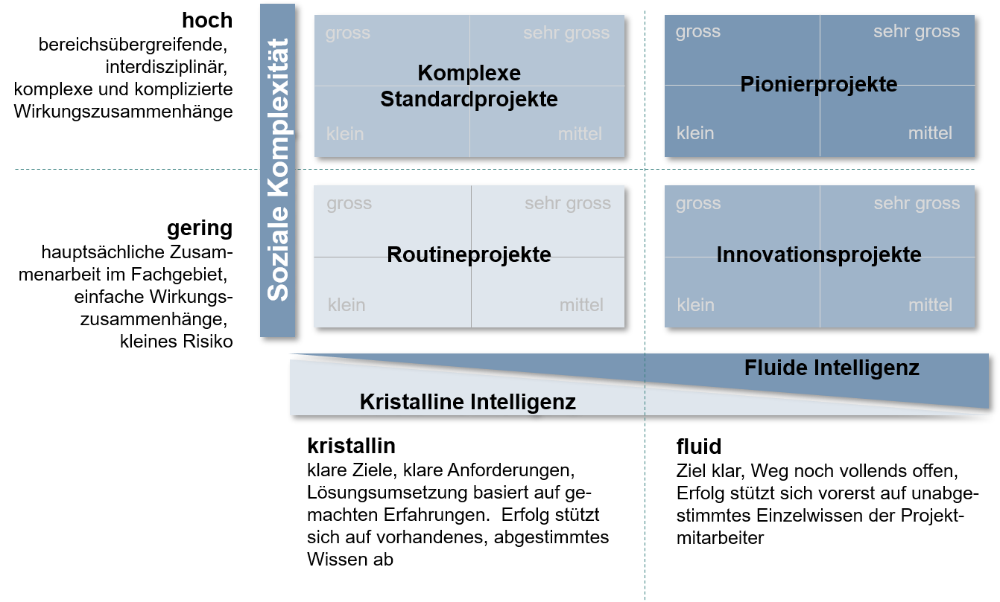

Pionierprojekte werden durch die Anzahl der Durchführungen gekennzeichnet. Bei dieser Art ist entscheidend, dass es zum ersten Mal umgesetzt wird. Man spricht von einmaligen Projekten, "die in der Gesamtheit ihrer Bedingungen einmalig sind und in dieser Form noch nie durchgeführt wurden." Sobald das Projekt öfters durchgeführt wird, spricht man von [Routineprojekten](https://github.com/ManagingProjectsSuccessfully/ManagingProjectsSuccessfully.github.io/blob/main/kb/Routineprojekte.md).[^1]  

## Eigenschaften von Pionierprojekten
* sehr risikoreich, da keine Erfahrungsberichte ([Risikomanagement](https://github.com/ManagingProjectsSuccessfully/ManagingProjectsSuccessfully.github.io/blob/main/kb/Risikomanagement.md))
* Aufgabenumfang sehr schwer einzuschätzen
* hoher Mehrwert bei Abschluss
* hoher Neuigkeitsgehalt [^2]

## Beispiele von Pionierprojekten
### 1.Biogemüseanbau in Otterfing
Familie Hellwasser in Otterfing entschied sich für den Anbau von Gemüse in Bio-Qualität. „Weil es richtig ist, wegzukommen von Pflanzenschutzmitteln und übertriebenen Produktionsmengen“, war ihre Aussage. Nach der Ernte verkaufen Sie ihre erzeugten Lebensmittel im eignen Hofladen und auf dem regionalen Wochenmarkt. Sie bekamen sehr positiven Zuspruch von ihren Kunden über ihr Pionierprojekt zum Anbau von saisonalem und regionalem Gemüse.[^3]

### 2.selbstgemachtes Wärmenetz in Westerham
In Westerham hat Herr Helmut Schulte ein Pilotprojekt gestartet. Durch eine notwendige Häusersanierung wollte er eine nachhaltige Möglichkeit die Häuser zu heizen. Dies wurde zuerst mit Gas, anschließend mit Hackschnitzelheizung und Nahwärmenetz umgesetzt. Das überschüssige Restholz seiner Landwirtschaft wurde vom Restprodukt zum Brennholz und somit heizt er nun mit CO2 neutralen Brennstoff. Aktuell arbeitet er an neuen Projekten, wie zum Beispiel einem Blockheizkraftwerk und der Vernetzung von Photovoltaikanlagen, sodass er immer weniger abhängig ist.[^3]

### 3.Bartang has a Future!
In Bartang herrscht eine sehr hohe Arbeitsmigration. Deshalb werden durch „Bartang has a Future“ verschiedene „Pionierprojekte“ der Einheimischen gefördert und dadurch eine Möglichkeit geschaffen, das Potential der Region zu fördern.
Im Jahr 2019/2020 bekamen zwei Personen die Förderungsmittel, um ihre Projekte zu verwirklichen. Einer der Gewinner der Förderung wird nun sein kleines Gewächshaus gegen ein großes tauschen, es bewirtschaften und die Erfahrungen mit einer Schulklasse teilen.[^4]

### 4.Entsalzung des Wassers in Katar
In zahlreichen Pilotprojekten werden Techniken erprobt, mit denen Nahrungsmittelanbau unter der sengenden Sonne Katars möglich werden soll. Durch den deutschen Konzern Siemens soll eine neue Technik zum Einsatz kommen, um das Meerwasser günstiger und energieeffizienter zu entsalzen. Das daraus gewonnene entsalzte Meerwasser soll für die Bewässerung von Gemüseanbau verwendet werden. Pflanzen sollen nun in einer Nährlösung, statt in Erde aufgezogen werden und mit dem gewonnenen Wasser gegossen werden. Das Meerwasser wird unter Strom gesetzt und es bilden sich elektrische Felder. Dadurch spaltet sich das Salzwasser in entsalztes Wasser und Salz. Diese Technik ist wesentlich günstiger und energiearmer als die bereits genutzten Entsalzungsanlagen.[^5]

### 5.Stopp der Desertation des Gebietes der Wüste Negev
In Israel wird aktuell ein Projekt gegen die Verwüstung von Landschaft umgesetzt. Durch Bäume soll die Wüste mit möglichst einfachen Mitteln bekämpft werden. In der Wüste Negev setzt die Organisation „Jüdische Nationalfonds“ (JNF-KKL) das Projekt um und versucht durch Pflanzen von bisher 200 Millionen Bäumen die Verwüstung des Landes Israel zu stoppen. 
Die Zielsetzung dieses Projektes bezieht sich auf der Verwandlung von Wüstenboden in nahrhaften Grund. Durch das zurückkehren von einst beheimateten Tieren wird der Boden sich von selbst regenerieren. Zusätzlich zur Bepflanzung des Wüstengebiets müssen Sammelbecken zur Bewässerung der Bäume angelegt werden, da aktuell mehr Wasser verdunstet als Regen fällt.[^5]

## Weitere Projektarten:
*	[Routineprojekte](https://github.com/ManagingProjectsSuccessfully/ManagingProjectsSuccessfully.github.io/blob/main/kb/Routineprojekte.md)
*	[Innovationsprojekte](https://github.com/ManagingProjectsSuccessfully/ManagingProjectsSuccessfully.github.io/blob/main/kb/Innovationsprojekte.md)
*	[Forschungsprojekte](https://github.com/ManagingProjectsSuccessfully/ManagingProjectsSuccessfully.github.io/blob/main/kb/Forschungsprojekte.md)
*	[Entwicklungsprojekte](https://github.com/ManagingProjectsSuccessfully/ManagingProjectsSuccessfully.github.io/blob/main/kb/Entwicklungsprojekte.md)
*	[IT-Projekte](https://github.com/ManagingProjectsSuccessfully/ManagingProjectsSuccessfully.github.io/blob/main/kb/IT-Projekte.md)
*	[Bauprojekte](https://github.com/ManagingProjectsSuccessfully/ManagingProjectsSuccessfully.github.io/blob/main/kb/Bauprojekte.md)

*Diagramm zur Einteilung der Projektarten*

# Siehe auch
*	[Routineprojekte](https://github.com/ManagingProjectsSuccessfully/ManagingProjectsSuccessfully.github.io/blob/main/kb/Routineprojekte.md)
*	[Innovationsprojekte](https://github.com/ManagingProjectsSuccessfully/ManagingProjectsSuccessfully.github.io/blob/main/kb/Innovationsprojekte.md)

# Quellen

[^1]: https://bwl-wissen.net/definition/projektmanagement
[^2]: https://www.kdw-its.de/pm-standards-methoden/pm-methoden/projektarten-matrix/
[^3]: https://www.kulturvision-aktuell.de/pionierprojekte-in-otterfing-und-westerham/
[^4]: https://www.bartang-has-future.com/deutsch/aktuell-pionierprojekte-projekt/
[^5]: https://www.wiwo.de/technologie/green/ausbreitung-der-wueste-pionierprojekte-zeigen-wie-sie-sich-aufhalten-laesst/13549084.html 

