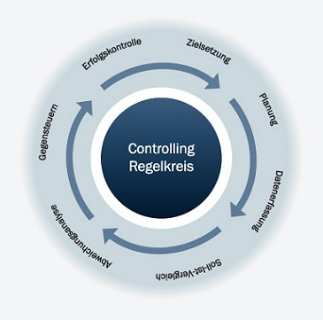
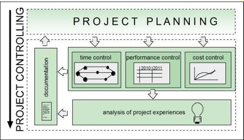

Das Projektcontrolling ist ein Bestandteil des [Projektmanagements](Projektmanagement.md).[^6] Es handelt sich dabei um einen [Steuerungs](Projektsteuerung.md)- und Koordinationsprozess[^4], der durch die [DIN 69901-5](https://de.wikipedia.org/wiki/DIN_69901) als "Sicherung des Erreichens der Projektziele durch: Soll-Ist-Vergleich, Feststellung der Abweichungen, Bewerten der Konsequenzen und Vorschlagen von Korrekturmaßnahmen, Mitwirkung bei der Maßnahmenplanung und Kontrolle der Durchführung" [^5]
definiert wird.
# Controlling Regelkreis
Häufig wird (Projekt-)Controlling fälschlicherweise mit Kontrolle gleichgesetzt, es umfasst allerdings weitaus mehr. Die verschiedenen Schritte des Controlling-Prozesses sind in der folgenden Abbildung als projektspezifischer „Controlling Regelkreis“ illustriert.

*Der Controlling Regelkreis* [^3]

Dieser beschreibt einen sich wiederholenden Zyklus, dessen Häufigkeit sich nach dem [Projektumfang](Projektumfang.md) richten sollte. Dabei kann sowohl das gesamte [Projekt](Projekt.md), als auch nur einzelne [Phasen](Projektphasen_klassisch.md) betrachtet werden.[^3]

# Teilbereiche des Projektcontrollings[^6] 
Das Projektcontrolling lässt sich in die drei fundamentalen Teilbereiche Kalkulation, Leistung und Kontrolle untergliedern. Diese dienen Unternehmen als Basis zur Planung, Durchführung und Erfolgsbeurteilung der Projekte. 

## Projektkalkulation
In der Vorbereitungs- und Planungsphase erfolgt die Kalkulation des Projektes. In diesem Zeitraum werden Gesamtkosten, variable Kosten sowie Fixkosten systematisch erhoben. Bei mittel- bis langfristigen Projekten ist es sinnvoll, das Projekt in mehrere Abschnitte zu untergliedern. Das hat den Vorteil, dass man jeder Etappe gesondert die entstandenen Kosten zuordnen kann.

## Projektleistung
Zu Beginn werden qualitative Merkmale des Projekts, die Projektleistung, determiniert. Das Projektcontrolling hat die Aufgabe, diese zu kontrollieren, um bei potentiellen Abweichungen frühzeitig Gegenmaßnahmen einzuleiten.

## Projektkontrolle
Soll und Ist-Kosten des Projekts werden über den gesamten [Projektlebenszyklus](Projekt_Lebenszyklus.md) im Blick behalten, um Kostenabweichungen zu identifizieren. Eine reine Gegenüberstellung der Kosten liefert nur bedingt einen Mehrwert. Diese Vorgehensweise berücksichtigt nicht, ob das Projekt durch Beschleunigungskosten vorzeitig fertiggestellt werden kann. Eine Termin-Kosten-Kontrolle hingegen, verschafft einen genaueren Einblick in die Gesamtkosten. 

# Kennzahlen und Methoden
## Kennzahlen
Die elementare Basisgröße des Projektcontrollings ist der Projekterfolg.[^11] Dieser ist [messbar](Erfolgsmessung.md) anhand der drei Kenngrößen des [Projektdreiecks](Magisches_Dreieck.md), welche im Laufe des Projekts geplant und anschließend überwacht werden müssen.[^9]
Die Kenngrößen des Dreiecks umfassen:

* Termine
* Qualität
* Kosten

*Überwachung der Kennzahlen des Projektdreiecks im Projektcontrolling-Kontext*[^10]

## Methoden
Mittlerweile finden viele, größtenteils standardisierte Methoden Anwendung im Projektcontrolling. Bei der Wahl der geeigneten Methode(n), sollten [Umfang](Projektumfang.md), Dauer und Komplexität des Projektes berücksichtigt werden.

Grundsätzlich gilt hier die Devise: **Je einfacher und durschaubarer die Methode, desto besser.**

### [Meilensteintrendanalyse](Meilensteintrendanalyse.md)
Die Definition von [Meilensteinen](Meilensteine.md) ist Grundlage dieser Methode. Diese werden am Anfang des Projekts für die [Projektplanung](Projektplanung.md) festgelegt.[^13] Die Meilensteintrendanalyse stellt Änderungen im Terminplan grafisch dar. Sie reiht alle [Meilenstein](Meilensteine.md)-Termine chronologisch auf, wodurch sich Trends frühzeitig abzeichnen.

### Earned Value Analyse
Eine weitere Methode ist die Earned Value Analyse, mit der man den Fertigstellungsgrad des Projekts bzw. einzelner Phasen ermitteln kann. Sie dient dem Projekt als Kontrollinstrument des Fortschritts. Diese Methode ist ebenfalls unter den Namen Leistungswertanalyse, Fertigstellungswertmethode oder Arbeitswertanalyse bekannt.[^7]

### Projektplan
Den Mitarbeitern werden im Projektplan ihre Aufgaben sowie deren Bearbeitungszeiträume zugeteilt. Der Projektmanager hat somit stets den Überblick über die [Aufgabenteilung](Aufgabenteilung.md) und Termintreue der jeweiligen Projektabschnitte.[^8] Der Umfang des Projektplans richtet sich nach der Größe und Komplexität des Projekts. Folgende Pläne sollten aber in jedem Fall enthalten sein:
* [Projektstrukturplan](Projektstrukturplan.md)
* Ablaufplan (als Tabelle, [Netzplan](Netzplantechnik.md) oder [Gantt-Diagramm](Gantt_Diagramme.md))
* [Kostenplan](Kostenplanung.md)
* [Ressourcenplan](Ressourcenplanung.md)[^12]

### Ampelmethode
Durch die Visualisierung der Arbeitspaketestatus mit Ampelfarben, ist die Methode besonders intuitiv. Ein Nachteil der Methode ist der Auslegungsspielraum der Ampelfarben. Um diese Gefahr zu minimieren, ist es unabdingbar, die Farben klar zu definieren. Gemeinhin bedeuten die verschiedenen Ampelphasen:
*  Grün:  Alles läuft nach Plan
* Gelb: Es sind signifikante Planabweichungen zu befürchten
* Rot:  Eine Zielerreichung scheint nicht mehr möglich[^3]

### Soll-Ist-Vergleich
Hierbei handelt es sich um eine simple, sich selbsterklärende Methode. Es werden die ermittelten Ist-Werte mit den vom Kunden vorgegebenen Soll-Werten verglichen.
Die Vergleichswerte können Kosten, Arbeitszeiten, Qualitätseigenschaften uvw. sein. Aus dem Vergleich ergibt sich ein Gesamtunterschied zwischen den geplanten und tatsächlichen Werten. Sind die Ist-Werte besser als die Soll-Werte, fällt der Soll-Ist-Vergleich positiv, andernfalls negativ aus.[^14]

# Siehe auch
* [Projektmanagement](Projektmanagement.md)
* [Projektsteuerung](Projektsteuerung.md)
* [Projektumfang](Projektumfang.md)
* [Erfolgsmessung](Erfolgsmessung.md)
* [Aufgabenteilung](Aufgabenteilung.md)
* [Meilensteine](Meilensteine.md)
* [Projektlebenszyklus](Projekt_Lebenszyklus.md)
* [Meilensteintrendanalyse](Meilensteintrendanalyse.md)
* [Netzplan](Netzplantechnik.md)
* [Gantt-Diagramm](Gantt_Diagramme.md)
* [Projektphasen](Projektphasen_klassisch.md)

# Weiterführende Literatur

* Basics
  * https://www.projektmanagementhandbuch.de/handbuch/projektrealisierung/projektcontrolling/
  * https://www.youtube.com/watch?v=2OTCNh0TzLw
* Deep Dive: 
  * https://www.youtube.com/watch?v=la1PUSoGBxk
  * Zirkler B., Nobach K., Hofmann J., Behrens S. (2019) Das Projektcontrolling. In: Projektcontrolling. Springer Gabler, Wiesbaden. https://doi.org/10.1007/978-3-658-23714-1_3

# Quellen

[^3]: [Projektmanagement Handbuch](https://www.projektmanagementhandbuch.de/handbuch/projektrealisierung/projektcontrolling/) (abgerufen am 14.12.2021)
[^4]: https://doi.org/10.1007/978-3-658-23714-1
[^5]: Fiedler R. (2020). *Controlling von Projekten. Mit konkreten Beispielen aus der Unternehmenspraxis – Alle controllingrelevanten Aspekte der Projektplanung, Projektsteuerung und Projektkontrolle*.Springer Vieweg https://doi.org/10.1007/978-3-658-28032-1
[^6]: [Teilbereiche des Projektcontrollings](https://refa.de/service/refa-lexikon/projektcontrolling) (abgerufen am 14.12.2021)
[^7]: Bär C., Fiege J., Weiß M. (2017).*Projektcontrolling. In: Anwendungsbezogenes Projektmanagement*.Springer Vieweg.https://doi.org/10.1007/978-3-662-52974-4_8.
[^8]: [Kennzahlen und Methoden des Projektcontrollings](https://de.wikipedia.org/wiki/Projektcontrolling#Kennzahlen_und_Methoden_des_Projektcontrollings) (abgerufen am 14.12.2021)
[^9]: Beifuss A., Holzbaur U. (2020). *Projektcontrolling. In: Projektmanagement für Studierende*. Springer Gabler. https://doi.org/10.1007/978-3-658-32664-7_4
[^10]: [Ablaufschema des Projektcontrollings](https://www.geo.fu-berlin.de/en/v/proposal_writing/learning_content/7_project_management/controlling/index.html) (abgerufen am 14.12.2021)
[^11]: Steffens T. (2007). *Projektcontrolling. Methoden der Planung, Kontrolle und Steuerung*. GRIN Verlag. https://www.grin.com/document/89579
[^12]: [Projektplan](https://www.projektmagazin.de/glossarterm/projektplan) (abgerufen am 14.12.2021)
[^13]: [Meilensteintrendanalyse](https://de.wikipedia.org/wiki/Meilensteintrendanalyse) (abgerufen am 14.12.2021)
[^14]: [Soll-Ist-Vergleich](https://www.kayenta.de/projektmanagement-glossar-lexikon/begriffserklaerung/soll-ist-vergleich.html) (abgerufen am 14.12.2021)
