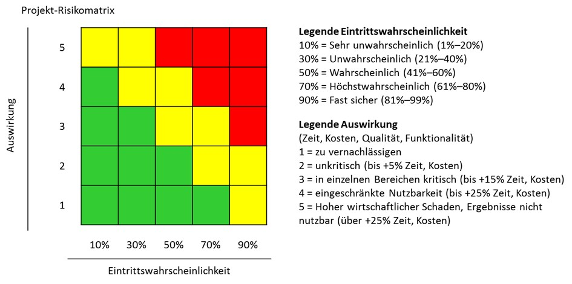
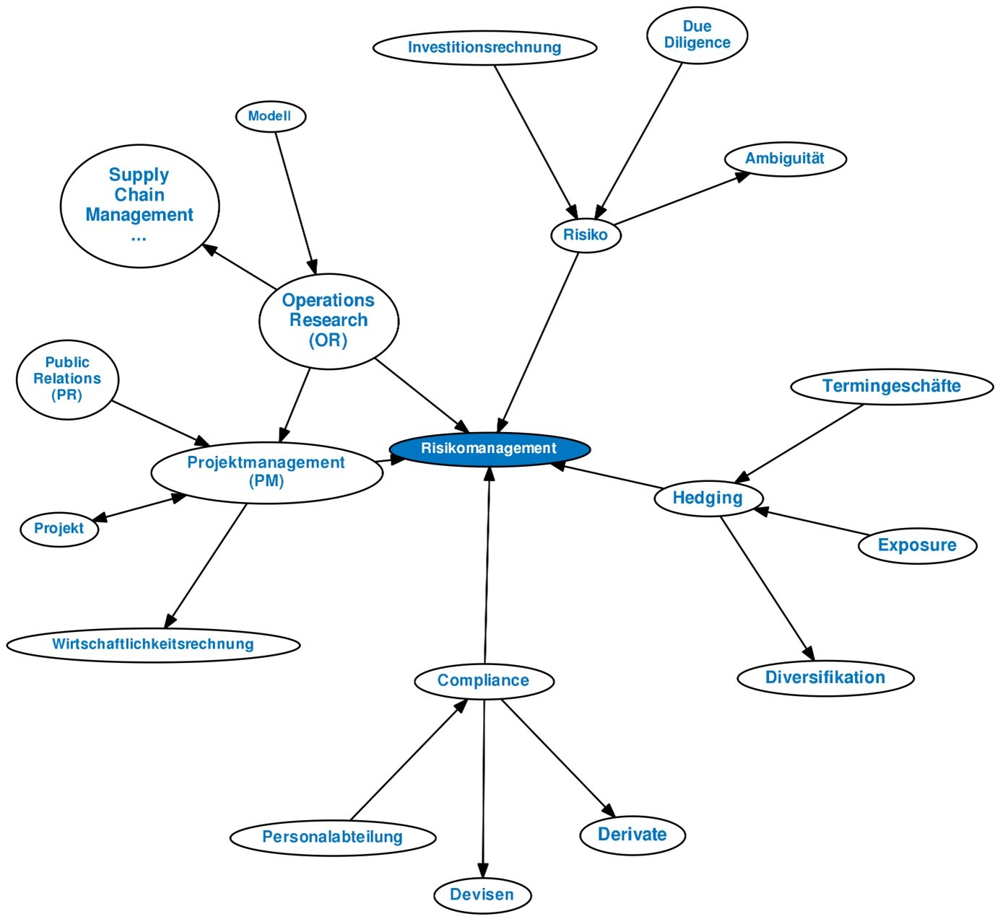

 # 1. Warum Risikomanagement?
 
Ob Gesetzesänderungen, Wechselkursschwankungen oder Umweltkatastrophen – Firmen unterliegen, je nach Branche und Unternehmensgröße, diversen Risiken, die mit unterschiedlichen Faktoren zusammenhängen.[^1]
Dabei versteht man unter einem Risiko die Eintrittswahrscheinlichkeit eines negativen Ereignisses, welches zu einem möglichen Schaden führen kann.[^2]

Es wird zwischen zwei Arten von Risiken unterschieden.

interne Risiken:
-  oft durch operative Abläufe oder Fehlentscheidungen verursacht
- z.B.: Bereiche wie Produktentwicklung, Marketing, Versicherungen, Vertrieb etc.

externe Risiken:
- äußere Einflüsse, die Unternehmen nicht beeinflussen können
- z.B.: politische Entscheidungen, Wettbewerbs- und Marktsituationen, Rezession oder Steuererhöhungen[^3]

Zentrale Aufgabe des Risikomanagements ist es diese Risiken so früh wie möglich zu erkennen, um nach umfangreicher Analyse entsprechende zielgerichtete Gegenmaßnahmen definieren und durchführen zu können.

Im Folgenden soll sich auf das klassische Risikomanagement beschränkt werden.

# 2. Definition
Unter Risikomanagement werden alle Aktivitäten zusammengefasst, die sich mit der Identifizierung von Risiken beschäftigen, sodass diese systematisch erfasst und bewertet werden können.[^4]  

# 3. ISO 31000 als Basis-Norm
Seit 2008 gilt die internationale Norm ISO 31000 Risiko Management als weltweit gültiger Standard im Risikomanagement, welcher drei wesentliche Prinzipien berücksichtigt: 

1. Risikomanagement wird als Führungsaufgabe verstanden und basiert auf dem Prinzip des PDCA-Zyklus (Plan-Do-Check-Act)

2. Umsetzung des Top-Down-Ansatzes, d.h. der Anstoß zur Umsetzung der zu planenden Maßnahmen kommt von „oben“ und wird in die untergeordneten Hierarchiebereiche einer Organisation transportiert [^5]

3. Berücksichtigung aller (strategisch/finanziell/operativ/personell/regulatorisch/politisch/technisch) Risiken in einer Organisation [^6]

# 4. Ablauf

## 4.1 Risikoidentifizierung

- Risikoanalyse mit detaillierter Bestandsaufnahme
- alle bestehenden und potenziellen Risiken, die das Erreichen der Ziele gefährden können, werden aufgelistet
- Möglichkeiten: SWOT-Analyse, PEST-Analyse, Checklisten, Frühwarnsysteme

Bsp.: SWOT-Analyse

Sie dient der besseren Einschätzung der eigenen Situation im Hinblick auf S=Strenghts, W=Weaknesses, O=Opportunities und T=Threats. Dabei wird die Konkurrenz analysiert und die Ergebnisse als Chancen-Risiken-Katalog zusammengestellt und anschließend in Relation zum internen Profil des Unternehmens gesetzt.
Dann werden die Überschneidungen zwischen externen und internen Bereichen erfasst und in einer SWOT-Matrix dargestellt, welche die ausbaufähigen Chancen und abzusichernden Risiken zeigt.

## 4.2 Risikobewertung

- Bewertung anhand Schadensausmaß (1=geringfügiges Ausmaß; 10= existenzgefährdend) und Eintrittswahrscheinlichkeit (1=unwahrscheinlich, 10= sehr wahrscheinlich) z.B. auf einer Skala von 1 bis 10, kann aber auch anders kategorisiert werden (siehe Graphik)
- Schadensausmaß * Eintrittswahrscheinlichkeit = Schadenserwartungswert
- Risikodiagramm anfertigen, welches auf der X-Achse die Wahrscheinlichkeit und auf der Y-Achse das Ausmaß zeigt
- Risiken mittels ermittelten Schadenswert in Matrix eintragen
somit: visualisierte Darstellung von Rangfolge und Handlungsbedarf der Risiken 

## 4.3 Risikosteuerung

- notwendige Handlungsmaßnahmen planen & durchsetzen
- nach Wichtigkeit geordnet müssen zuerst Maßnahmen gegen rote Risiken geplant werden, dann gegen gelbe und grüne Risiken 
- zentrale Fragestellung: Lohnt sich der Aufwand für die Umsetzung einer Maßnahme in Relation zum Risiko?

Möglichkeiten
- Risiken akzeptieren (Nulloption), da unvermeidbar/nicht reduzierbar
- Risiken vermeiden, d.h. potenzieller Gefahrenquellen beseitigen
- durch vorausschauende Maßnahmen Risiken reduzieren & Eintrittswahrscheinlichkeit verringern
- Risiken abwälzen bzw. verlagern ([Risikotransfer](Risikotransfer.md)), d.h. Absicherung der (finanziellen) Auswirkungen eines Risikos durch Verlagerung an Personen außerhalb des Projekts

## 4.4. Risikoüberwachung

- kontinuierlicher Prozess der Prüfung auf Effizienz der umgesetzten Maßnahmen ist erforderlich, da sich die Eintrittswahrscheinlichkeit im Laufe der Zeit verschieben kann. 
- Transparenz gegenüber Stakeholdern ausweisen [^7]

# 5. Fazit

Ob im [Projektmanagement](Projektmanagement.md), Compliance oder Hedging – die Mindmap zeigt, dass die Absicherung gegenüber Risiken jederzeit gewährleistet sein muss, damit Prozesse langfristig erfolgreich ablaufen können und die benötigte Liquidität stets sichergestellt ist:[^8]

# Siehe auch
- [Projektmanagement](Projektmanagement.md)
- [Risikotransfer](Risikotransfer.md)
- 

# Quellen

[^1]: [Einführung Risiko](https://sevdesk.de/blog/risikomanagement/#definition)
[^2]: [Begriffserkärung Risiko](https://www.business-wissen.de/hb/ziele-und-aufgaben-des-risikomanagements-im-unternehmen/)
[^3]: [Kategorisierung von Risiken](https://treuenfels-personalberatung.com/fokusthemen/risikomanagement/)
[^4]: [Defintion Risikomanagement](https://www.business-wissen.de/premium/risiken-identifizieren/)
[^5]: [ISO 31 000](https://www.risikomanagement-wissen.de/risikomanagement/risikomanagement-einfuehrung/iso_31000/)
[^6]: [Arten von Risiken](https://sevdesk.de/blog/risikomanagement/#ziele)
[^7]: [Ablauf Risikomanagement](https://sevdesk.de/blog/risikomanagement/#definition)
[^8]: [relevante Bereiche des Risikomanagements](https://wirtschaftslexikon.gabler.de/sites/default/files/graph/extended/risikomanagement-42454.png)
