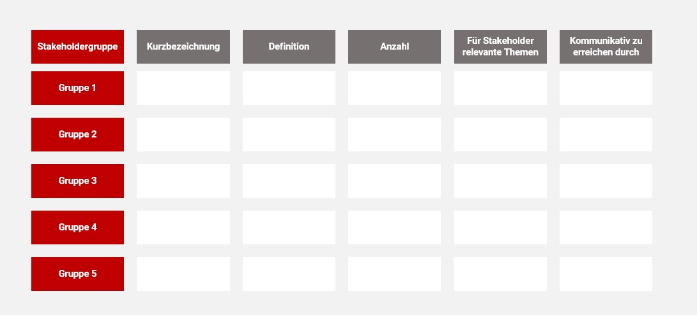

# Stakeholderanalyse

Eine [Stakeholderanalyse](Stakeholderanalyse.md) hat das Ziel die Interessensgruppen eines [Projekts](Projekt.md) und deren Einfluss auf Entscheidungen zu identifizieren. Hierbei werden die Stakeholder zueinander in Beziehung gesetzt und kategorisiert. Somit können Sie durch Strategien gezielt gesteuert und in eine bestimmte Richtung gelenkt werden [^1][^2].

## Hintergrund

Der Begriff Stakeholder beschreibt ein direktes Interesse an einem [Projekt](Projekt.md) von einzelnen Personen, Gruppen, Unternehmen oder Vereinigungen. Viele Stakeholder wollen bei den Verläufen von [Projekten](Projekt.md) eingebunden sein und so ihre Belange zu ihrem Vorteil durchsetzen [^3].

Stakeholder können in intern und extern gegliedert werden. Nachfolgend sind einige Beispiele von möglichen Stakeholdern aufgezählt [^4]:

* Konkurrenten
*	Umweltverbände
*	Medien
*	Anwohner
*	Mitarbeiter
* Politik
*	Gewerkschaften
*	Investoren
*	Kunden

Die Notwendigkeit eines [Stakeholdermanagements](Stakeholdermanagement.md) ist essenziell. Ein ungeplantes Einschreiten bzw. ein nicht erwartetes Handeln von Stakeholdern kann Projekte in zeit- und kostentechnischer Hinsicht gefährden, wenn nicht sogar zum Scheitern bringen. Daher ist es das oberste Ziel des [Stakeholdermanagements](Stakeholdermanagement.md) die Stakeholder zu identifizieren, einzuschätzen und bei diesen durch geeignete Maßnahmen eine Akzeptanz für das Projekt zu schaffen. Aus diesem Grund ist eine umfangreiche Analyse der Interessensgruppen und deren Einstellung zu den betroffenen Projektthemen unabdingbar. Dies geschieht anhand einer [Stakeholderanalyse](Stakeholderanalyse.md) [^5]. 

## Anwendung

In einem ersten Schritt sind die relevanten Stakeholder des Projekts zu identifizieren. Hierbei sollten alle berücksichtigt werden, die in irgendeiner Art und Weise mit dem Projekt in Verbindung stehen. Hierbei kann bereits eine Kategorisierung der Stakeholder stattfinden sowie wichtige Schlüsselfunktionen der Personen und Interessensgruppen vermerkt werden. Für die Identifikation der Stakeholder existieren verschiedene Verfahren. Einige werden nachfolgend beispielhaft aufgelistet [^5].

Identifikation durch:

* Experten/Delphimethode 
* Andere Stakeholder (Interviews und Diskussionen) 
* Sekundärforschung und statistische Daten 
* Mündliche oder schriftliche Berichte über große Ereignisse 
* Kreativitätstechniken wie Brainstorming 
* SWOT-Analysen 

Anschließend muss die Einstellung der Stakeholder gegenüber dem Projekt bewertet werden. Hierbei wird beispielsweise zwischen positiv, neutral und negativ unterschieden. Die Einschätzungsskalen können je nach der gewollten Genauigkeit variieren. Die Interessen der Stakeholder lassen sich aus ihren Bedürfnissen ableiten und spiegeln sich in Hinsicht auf das Projekt als konkrete Erwartungen und Ziele wider. Diese Informationen sind entscheidend für das weitere Vorgehen [^5].

Ein nächster wichtiger Schritt ist die Bewertung der Relevanz von den betroffenen Stakeholdern.  In diesem Zusammenhang wird sich die Frage gestellt, wer wie wichtig für das jeweilige Projekt ist. So kann ein Ranking erstellt werden, um die bedeutungsvollsten Interessensgruppen von dem Projekt zu überzeugen. Anschließend sollen diese mit passenden Strategien und Maßnahmen in das Projekt eingebunden werden. So wird sich die Unterstützung dieser Parteien gesichert.

Es ist zu bedenken, dass sich die Meinung von Stakeholdern während eines Projekts ändern kann. Aus diesem Grund ist es auch im Rahmen des [Projektcontrollings](Projektcontrolling.md) essenziell, die Interessensgruppen auf dem Laufenden zu halten und sich mit diesen abzustimmen, damit ein erfolgreicher [Projektabschluss](Projektabschluss.md) erfolgen kann [^4].

Ein Template für eine Stakeholderanalyse könnte beispielsweise folgendermaßen aussehen [^4]:

Ein zusätzlich oft genutztes Tool ist die Macht/Interesse-Matrix nach Johnson/Scholes (1999). Mit dieser kann das Verhältnis zwischen der Macht und dem Interesse einzelner Stakeholder sowie die Entwicklung während des Projektverlaufs grafisch dargestellt werden [^5], S. 34:

Nach dem Abschluss des Projekts sollte eine Kontrolle der Zielerreichung gemacht werden. Hierbei stellt sich vor allem die Frage, wie zuverlässig die [Stakeholderanalyse](Stakeholderanalyse.md) funktioniert hat. Dadurch kann aus den Erfahrungen für zukünftige Projekte gelernt werden. Die Wichtigkeit dieser Analyse sollte nicht unterschätzt werden. Die Stakeholder tragen eine wichtige Rolle im Verlauf eines Projekts und aus diesem Grund ist es entscheidend, wie gut das Projektteam diese identifiiert und eingschätzt hat, um entsprechend handeln zu können. 

## Siehe auch

* [Stakeholderanalyse](Stakeholderanalyse.md)
* [Projekt](Projekt.md)
* [Stakeholdermanagement](Stakeholdermanagement.md)
* [Projektcontrolling](Projektcontrolling.md)
* [Projektabschluss](Projektabschluss.md)

## Quellen

[^1]: [www.controlling-wiki.de](https://www.controlling-wiki.com/de/index.php/Stakeholderanalyse)
[^2]: [wwww.betriebswirtschaft-lernen.net](https://www.betriebswirtschaft-lernen.net/erklaerung/stakeholderanalyse/)
[^3]: [www.projektmanagement-manufaktur.de](https://projektmanagement-manufaktur.de/stakeholderanalyse)
[^4]: [www.strategische-wettbewerbsbeobachtung.com](https://www.strategische-wettbewerbsbeobachtung.com/wiki/stakeholderanalyse/)
[^5]: [Krips D., 2017, Stakeholdermanagement, Springer Verlag](https://link.springer.com/book/10.1007/978-3-662-55634-4)
