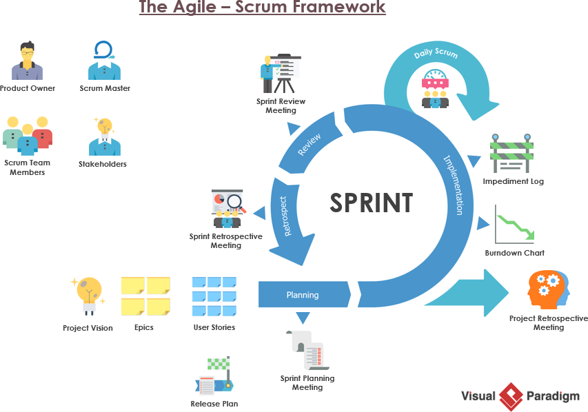

Stand Ups beschreiben Meetings welche im stehen gehalten werden. Der Umfang solcher Meetings ist geringer als bei klassischen Meetings. 
Desweiteren werden Stand Up Meetings häufiger, meist täglich, gehalten. Stand Ups werden in agilen Projekten häufig, wenn auch in verschiedenen
Ausführungen, genutzt. Dieses Kompendium fokussiert sich auf die Umsetzung von Stand Ups in agilen Projekten.

# Stand Ups in SCRUM

Tägliche Stand Up Meetings sind in Scrum fester Bestandteil eines Sprints (siehe [Abbildung 1]). Das Ziel dieser Meetings ist es den Fortschritt hinsichtlich des 
Sprint Ziels in Erfahrung zu bringen und falls notwendig Änderungen am Zeitplan vorzunehmen.[^1] 
Teilnehmer des sogenannten Daily Scrums sind ausschließlich Entwickler welche an dem Projekt arbeiten. Folgende Fragen muss jeder Entwickler individuell beantworten:

1. Was habe ich gestern geschafft?
2. Was werde ich heute tun?
3. Behindert mich etwas bei meiner Arbeit?

Durch die Beantwortung dieser drei Fragen soll sicher gestellt werden, dass jeder Entwickler fokussiert am Ziel des Sprints arbeitet.[^2] Der Daily Scrum 
ist, gegensätzlich zu Stand Up Meetings in Kanban, auf die Personen fokussiert. Jede der zu beantwortenden Fragen ist auf den Entwickler selbst bezogen
und nicht auf das Projekt bzw. Sprint.[^3]

*SCRUM Framework*

# Stand Ups in Kanban

Im Gegensatz zu Daily Scrums, enthält ein Kanban Stand Up Meeting keine strikt zu beantwortenden Fragen. Kanban Teams sind frei in der Gestaltung der Meetings 
und müssen keine Sprint Ziele erreichen. Das Ziel von Kanban ist es konstant Ergebnisse zu liefern. Deshalb befassen sich die täglichen Meetings mit der 
konkreten Darstellung der aktuellen Lage und davon ausgehend mit der Erfüllung Kanban spezifischer Elemente. Darunter fällt unter anderem die Reduktion
der Queue Aktivitäten, sowie die Limitation des Work-in-Progress.[^2]

Es ist dem Kanban Team ebenfalls frei gestellt ein tägliches Stand Up Meeting zu halten oder nicht. Es ist durchaus möglich in Kanban organisierten 
Projekten, klassische Meetings abzuhalten. In der Praxis wird dennoch häufig das Format eines Stand Up Meetings gewählt, bei dem der Prozess im Mittelpunkt
steht.[^3]

# Vorteile von Stand Ups

Kurze und zielgerichtete Meetings sind für agile Projekte unumgänglich. Der stetige Austausch im Team ermöglicht es schnell und effektiv Ziele zu erreichen und
Probleme zu indentifizieren. Ein Meeting im Stehen ist durchscnittlich 34% kürzer als ein Meeting im Sitzen. Die Qualität der Ergebnisse der verschiedenene Formate 
ist jedoch gleich. Teilweise werden die Ergebnisse der Stand Up Meetings als besser empfunden als Ergebnisse welche im Sitzen zustande gekommen sind.[^5]

# Fazit

Der höhere Effizienz bei gleichbleibender Effektivität lässt schlussfolgern, dass Meetings im Stehen besser geeignet sind um überschaubare Aspekte eines Projektes 
zu besprechen. Es ist anzunehmen das Meetings von einem mehrstündigen Umfang nicht für das stehende Format geeignet sind. Selbst unter der Annahme, dass die Effizienz 
im Stehen höher ist, wäre von einer geringeren Effektivität auszugehen. Diese Annahme wurde getroffen da die Ermüdungserscheinungen des mehrstündigen Stehen die Denkleistung
der Individuen beinträchtigt.

# Siehe auch

* [Kanban](/Kanban.md)
* [Scrum](/SCRUM.md)

# Quellen

[^1]: https://www.scrum.org/resources/what-is-a-daily-scrum (Stand 09.11.2021) Erklärung des Daily SCRUM
[^2]: https://www.conjur.org/blog/running-a-kanban-standup-meeting/ (Stand 09.11.2021) Stand Ups in Kanban
[^3]: https://kanbanize.com/blog/running-a-better-stand-up-meeting/ (Stand 09.11.2021) Effektive Gestaltung von Stand Ups
[^4]: [Advanced Formatting Syntax for GitHub flavored Markdown](https://docs.github.com/en/github/writing-on-github/working-with-advanced-formatting/organizing-information-with-tables)
[^5]: Bluedorn, A. C., Turban, D. B., & Love, M. S. (1999). The effects of stand-up and sit-down meeting formats on meeting outcomes. Journal of Applied Psychology, 84(2), 277–285. Effekte eines Stand Ups
