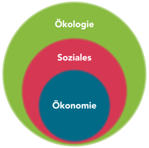

Die Triple Bottom Line ist ein Ansatz für nachhaltiges [Projektmanagement](Projektmanagement.md), bei dem der Unternehmenserfolg neben der Ökonomie auf
zwei weitere Dimensionen, nämlich Ökologie und Soziales beruht. Um nachhaltigen Erfolg zu haben, müssen  alle drei Bereiche berücksichtigt werden.[^1]

# Entstehung des Triple Bottom Line Ansatzes

Der Begriff der Triple Bottom Line wurde vor allem von dem amerikanischen Unternehmensberater John Elkington Mitte der 1990er Jahre geprägt. Er erweiterte damit die Sichtweise
von Unternehmen, nicht nur wirtschaftliche, sondern auch soziale und ökologische Aspekte gleichzeitig zu berücksichtigen, um langfristig eine erfolgreiche und [nachhaltige 
Entwicklung](Nachhaltige_Entwicklung.md) zu erreichen.[^2][^3] 
Zur gleichen Zeit wurde in Deutschland vom Verband der chemischen Industrie ein ähnliches Modell entwickelt.[^4]

# Konzept der Triple Bottom Line

Die Triple Bottom Line ist eine Art der Bilanzierung, ähnlich dem unteren Strich – Bottom Line – einer Gewinn-und-Verlust-Rechnung und besteht aus den Leistungsdimensionen
Wirtschaft, Soziales und Ökologie.[^2][^3] Dabei besteht die Herausforderung, die unterschiedlichen Dimensionen einheitlich zu messen, da sie anschließend miteinander verrechnet
werden.[^2] Das Ziel dabei ist, alle drei Bereiche zu berücksichtigen, um unterm Strich ein positives Ergebnis zu erzielen.[^3] Die Triple Bottom Line spiegelt somit den
Kernpunkt der Nachhaltigkeit wider, durch Messung der Auswirkungen aller Aktivitäten eines Unternehmens auf die Welt.[^2]
Die Definition von Nachhaltigkeit, an der sich das Konzept der Triple Bottom Line orientiert, wurde erstmals im Brundtland-Report 1987 beschrieben. Dieser besagt, dass eine
Entwicklung nachhaltig ist, wenn diese den Bedürfnissen der heutigen Generation entspricht, ohne die Bedürfnisse und Lebensstile folgender Generationen zu gefährden.[^5] 
Vom Modell der Triple Bottom Line gibt es bzgl. der Umsetzung verschiedene Abwandlungen und Erweiterungen.

## Drei-Säulen-Modell der Nachhaltigkeit

Beim klassischen Ansatz, dem Drei-Säulen-Modell der Triple Bottom Line oder manchmal auch als magisches Dreieck dargestellt, werden alle drei Dimensionen als gleich wichtig
anerkannt.[^8]

*Die drei Säulen der Nachhaltigkeit (links) und das magische Dreieck (rechts)[^6]*

Es erweitert den Aspekt der Nachhaltigkeit von dem ökologischen Bereich auch in die Bereiche Ökonomie und Soziales.[^7] Alle diese Bereiche müssen somit zwingend gleichbehandelt
werden, um nachhaltig zu sein. Die Nachhaltigkeit baut also auf der Dreidimensionalität auf und sobald eine davon vernachlässigt wird, kann ein Unternehmen bzw.
Projekt nicht nachhaltig erfolgreich sein.[^9]

## Vorrangmodell der Nachhaltigkeit

Im Gegensatz zum Drei-Säulen-Modell wird bei dem Vorrangmodell der Nachhaltigkeit eine Reihenfolge nach Wichtigkeit vorgenommen. An erster Stelle steht Ökologie, danach Soziales
und abschließend Ökonomie.[^10]

*Das Vorrangmodell der Nachhaltigkeit[^10]*

Dadurch, dass die Bereiche anderen untergeordnet sind, lässt sich eine Verhaltensmaxime daraus ableiten. So werden soziale Anliegen nur umgesetzt, wenn diese auch einen 
ökologischen Mehrwert besitzen. Ferner gilt dies auch für wirtschaftliche. So gibt es ohne ökologische Stabilität keine soziale und erst recht keine ökonomische.[^4][^10]

# Kritik an den Modellen der Triple Bottom Line

Der Hauptkritikpunkt am klassischen Drei-Säulen-Modell ist die sog. schwache Nachhaltigkeit, d.h. die Verschlechterung in einer Dimension wird mit der gleichzeitigen
Verbesserung in einer anderen verrechnet. Baut man beispielsweise ein Schwimmbad, wo ursprünglich ein See war, so zerstört man das Ökosystem, schafft aber auch sozialen und 
ökonomischen Nutzen.[^10] Ein weiterer Nachteil dieses Modells ist die nicht vorhandene einheitliche Messbarkeit der drei Bereiche für die Berechnung der Triple Bottom Line.[^2]
Im Vorrangmodell besteht das Prinzip der starken Nachhaltigkeit. Hier kann eine ökologische Verschlechterung nicht verrechnet werden bzw. kommt nicht zustande, da das 
ökonomische und soziale Handeln durch ökologische Grenzen eingeschränkt wird.[^10]

# Siehe auch

* [Triple_Bottom_Line_Nachhaltigkeit](Triple_Bottomline_Nachhaltigkeit.md)
* [Nachhaltige_Entwicklung](Nachhaltige_Entwicklung.md)
* [Projektmanagement](Projektmanagement.md)

# Weiterführende Literatur

* [The Triple Bottom Line](https://sustain.wisconsin.edu/sustainability/triple-bottom-line/)
* [Triple Bottom Line (3 pillars): sustainability in business](https://www.youtube.com/watch?v=2f5m-jBf81Q)

# Quellen

[^1]: [Nachhaltigkeit im Projektmanagement](https://link.springer.com/content/pdf/10.1007/978-3-658-20500-3.pdf)
[^2]: [The Triple Bottom Line: What Is It and How Does It Work?](http://web.mit.edu/afs.new/athena/course/2/2.813/www/readings/TripleBottomLine.pdf)
[^3]: [Finanzlexikon HZ: Triple-Bottom-Line](https://www.handelszeitung.ch/finanzlexikon/triple-bottom-line)
[^4]: [Nachhaltigkeit und Controlling](https://books.google.de/books?id=0r2OFMYRXL0C&pg=PA17&lpg=PA17&dq=VCI+triple+bottom+line&source=bl&ots=ca9bpT38Lc&sig=ACfU3U3NraWaKaB66BIjhwsOWWlHo2kjsA&hl=de&sa=X&ved=2ahUKEwjJjN3Tuov0AhUCif0HHZHWAG0Q6AF6BAgnEAM#v=onepage&q=VCI%20triple%20bottom%20line&f=false)
[^5]: [Nachhaltige Verwaltungsmodernisierung](https://dopus.uni-speyer.de/frontdoor/deliver/index/docId/493/file/DP-030.pdf)
[^6]: [Was bedeutet nachhaltig](https://www.finanzadmin.at/2020/was-bedeutet-nachhaltig)
[^7]: [Wissenschaftliche Dienste des deutschen Bundestags - Der aktuelle Begriff](http://webarchiv.bundestag.de/archive/2008/0506/wissen/analysen/2004/2004_04_06.pdf)
[^8]: [Was ist eigentlich die Triple-Bottom-Line?](https://lippold.bab-consulting.de/was-ist-eigentlich-die-triple-bottom-line)
[^9]: [Triple Bottom Line - wirtschaftlich beleuchtet](https://www.alexandria.unisg.ch/17725/1/TripleBottomLine.pdf)
[^10]: [Nachhaltigkeitsmodelle](https://klimaschutz.neustadt.eu/Ziele-Umsetzung/Klimawandel-Nachhaltigkeit/Nachhaltigkeitsmodelle/)

